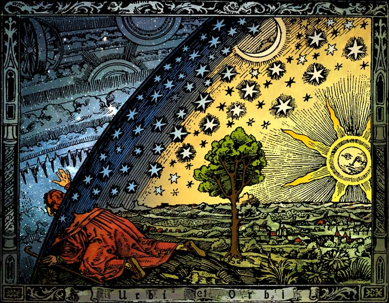

22 DEC 2025

Мне кажется это часто становится крайне смутной темой и отвечают на неё профессора по-разному и запутанно. Я предложу мб не совсем точный, но понятный вариант от себя.

 
И я дам определение исходя из исторического контекста философии.
Как мы её понимаем, западная философия зародилась в древней греции в 6 веке BCE. Часто за отправную точку принимают 585г. до н.э. и предсказание Фалесом затмения, что не очень похоже на предмет современной философии... Однако философия была первой человеческой наукой и определялась просто как тяга к бесполезным знаниям в противовес ремеслу. Реально, наука = бесполезные знания :) Можно сказать, что это развитая в область человеческого познания природная человеческая любознательность. Соответственно в неё входили и зародыши всех остальных наук: математика, биология, психология, политика и тому подобное... Btw сам термин философия скорее всего ввёл Пифагор и по его мнению целью занятия философии было становление человека богоподобным и поднятие на Олимп.

 
В процессе признании философии и развитии её подразделов из них отпочковывались отдельные науки. Особенно ясно это прослеживается в эпоху просвещения. Так сам Галилей всё ещё называл себя натурфилософом, но предложил новый взгляд на природу: вопрос "как?", а не "зачем?" и экспериментально его подпёр. Оттуда и зародилась современная физика. Аналогично можно проследить с другими науками, которые когда-то были частью философии.

 
Особенно нравится мне под эту идею пример психологии, которая отделилась от философии лишь в середине 19 века! Причиной тому опять же стало возникновение экспериментальных методов изучения работы мозга или что-то такое - я не биолог и не психолог :) Но везде пишут, что ещё долгое время психология во многом опиралась на философию и даже сейчас восходит к ней в особенно трудных задачах.

 
Отсюда видно, что в историческом контексте философия не столько изучает конкретные вопросы, сколько изучает то, что не изучают остальные науки. Другими словами это не наука, но область знания человека, которая изучает то, под что ещё не нашлось экспериментальных (чаще всего) и развитых методов, которые можно было бы выделить в отдельную науку. Это и есть моё определение.

 
Отсюда можно проследить свойства, присущие философии: расширенный и разнородный спектр вопросов изучения; умозрительный и теоретический характер; присутствие вопросов, кажущихся в целом нерешаемыми; отсутствие каких-либо однозначных выводов.

 
Так что забывая про философию, мы забываем и про все эти более трудные вопросы, которые, однако, по-прежнему интересуют людей и влияют на современное общество. К тому же из-за своего теоретического и полемического характера философия лучше других развивает навыки рассуждения и критического мышления, которые крайне важны и которых не достаёт огромного пласту людей в наше время ИМХО.