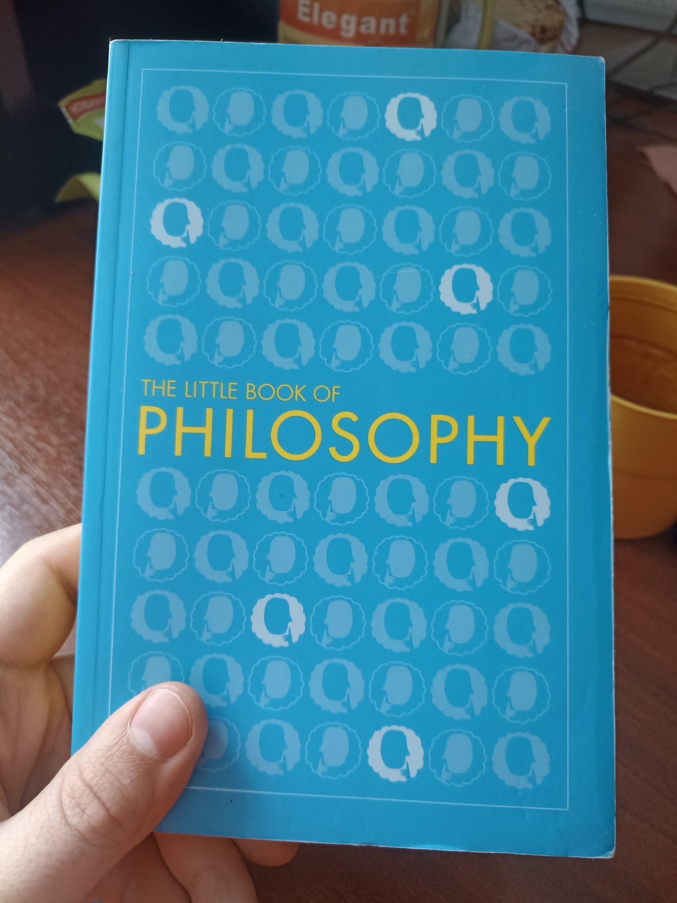
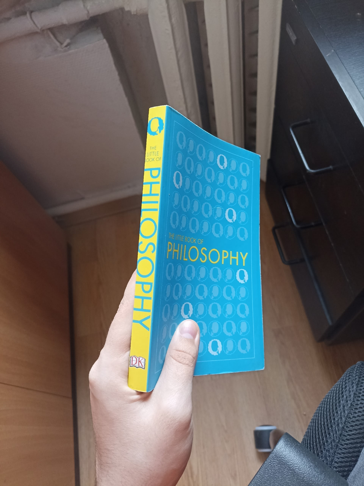
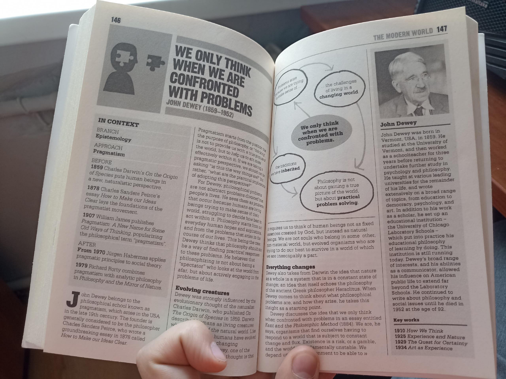

14 Feb 2026

Одновременно первая дочитанная мною книга по философии и первая дочитанная книга на английском, что делает её a little особенной. 
Книжка очень красивая по внутреннему оформлению (из-за этого и купил), всё очень структурированно расположено и изложено простым языком. Сама книга по истории философии для ничего не знающих, представляет из себя сборник энциклопедических сводок по главным философам всех эпох. Причём на каждого выделяется 1-2, макс. 3 оборота. Так что понятно, что излагается крайне поверхностно, но как иначе уместить всю историю в 200стр? В целом книгу я бы оценил чисто по содержанию на 7\10, что хотел получил, но впечатления на меня на произвела - выбор современных философов мне показался странноватым (будто я их знаю), а сводки по некоторым философам настолько историческими, что самой мысли за оборот я никакой не узнавал. По итогу всё что можно извлечь из такой книги это очень общее понимание того, как смещался предмет изучения философии и её стиль, а также какие-то основные движения были существовали. Далее, проанализировав прочитанное, как раз это, а точнее самые интересные для себя аспекты, я и изложу. 

 
Мысли:
1) Весьма интересно сравнить два стиля описания истории философии: через описание эпох мысли самих по себе, или даже скорее историю развития отдельных течений и через описание самих философов. Лично мне первый подход кажется лучше, но второй добавляет того самого энциклопедическоо функционала. 
2) Стоит перед этим задаться вопросом что более всего влияет на развитие философии. Ранее мне казалось, что главенствующий фактором является наука, т.к. она даёт новые сведения, например, по работе сознания, чтобы философы могли уточнять теории. Но на самом деле это не так. Наука по-прежнему влияет, но несоразмерно более влияет культура, развитие общества. Государственный строй и политика, устройство общества, перемены в его функционировании и его развитие - вот что предвещало перемены в философии, т.к. сами философы это те же самые люди, которые мыслят внутри этой культуры. Это далее будет явно видно - чаще всего повороты в философии происходили перед теми же поворотами в культуре, обосновывая их. В свою очередь философия обратно влияет на общество и через него и, в особенности, политических деятелей (имхо?) подталкивает развитие культуры.