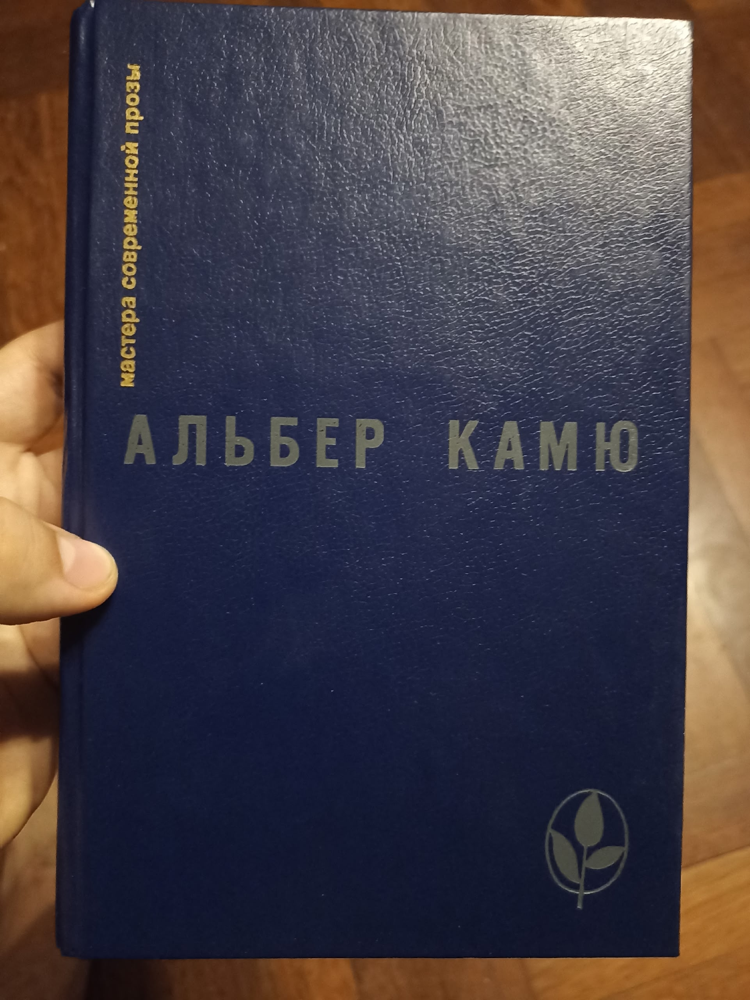
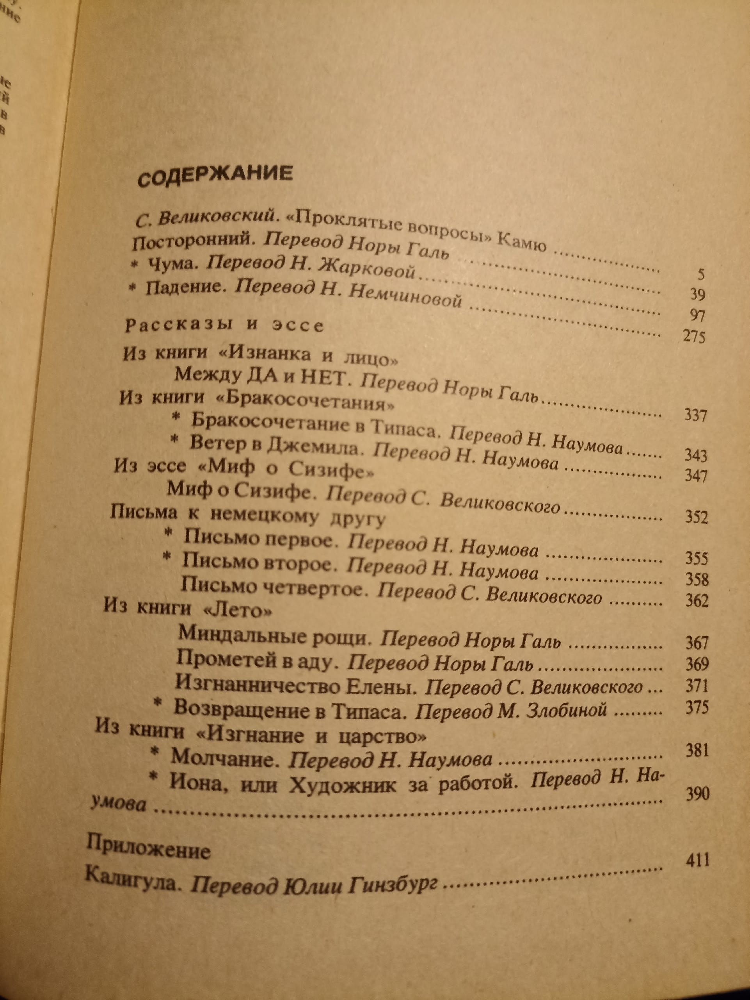

11 DEC 2025

Начну с себя. Сеголня дочитал эту книгу и наконец-то могу сделать краткий литературный обзор. Причëм это вторая худож. книга, что я прочитал за весь год(( Но tbh читаю я весьма медленно, на эту ушло чуть ли не 3 недели. Вот так уж мне нравится, вчитываться в образы, перечитывать параграфы и давать волю полëту фантазии, вдохновляемому строками. Только так в моëм понимании получаешь удовольствие от книги. И стоит признаться, что если бы я не спешил расширить свой кругозор большим количеством идей и образов, то, вероятно, остался бы на этой книге вдесятеро дольше: тут есть пища для ума. 

 
Почему Камю? 
1) Увлечение экзистенциализмом. 
2) Желание почитать "умную" литературу

 
Пара копеек о Камю. Он французский (алжирский) писатель-философ экзистенциалист, основные работы которого пришлись на 1935-1955 года. Получил нобелевку по литературе и считается преимущественно писателем, особенно философами. Однако также он всё же был философом и все его произведения это литература, пропитанная вовсю философией экзистенциализма. Он в начале своей карьеры стал автором фразы: "Хочешь философствовать - пиши романы". Сначала он так и делал, потом всë же начал писать отдельные философские эссе. Хочу ч этим введением передать именно то, что несмотря на то, что он писал кроме эссе повести, пьесы и романы, все они также создавались с замыслом между строк донести идеалогию Камю и наполнены идеями. И несмотря на то, что он считается "простым философом" и он специально пытался формулировать простые и прагматичные идеи (этим отдалив себя от зазнавшихся философов интеллигентов), читать мне его было всё же непросто, местами - трудно. Т.к завуалировав свои идеи в художественной форме, Камю одновременно сделал более наглядный художественный способ их подсознательной передачи и сделал дистилляцию самих идей более трудной. Да и слог у Камю (по крайней мере в переводах) читается не как по маслу, всё же весьма сухо и мудрëно. Т.к в большинстве своем в произведениях почти нет экшена, это либо хронологии, либо неспешный бытовой рассказ или пастельная зарисовка, но все они вдобавок наполовину состоят из внутренних монологов персонажей, которые иногда бывает сложно воспринимать. Что ж, я примерно описал чего от него ждать как автора. 

 
Теперь чуть-чуть об основной философии Камю, раз уже должно быть ясно как она важна для понимания произведений. В целом не могу пока сказать, что я спец. в этом (но собираюсь потом прочесть уже купленную книгу с двумя его самыми крупными эссе), так что опишу максимально просто от себя:
1) Первый период творчества
Основная идея, как и у многих философов того времени - полное отсутствие какого-либо смысла в мире. Все морали, ценности, действия человека случайны и не имеют какого-то трансцендентного значения. Понятие об этом возникает у него в процессе вырастания в тяжкой нищите. 
Также, ростя в Алжире у моря Камю живëт в красочных регионах, восхищаясь красотой природы. Можно сказать, что это, возможно, была его единственная отрада. 
Но нищета/божественная красота природы, добро/зло (альбом оксимирона красота и уродство luuul sorry I'm sorry) совсем рядом создают в сознании противоречие: как прекрасное может сосуществовать в таким жестоким? И ответом для Камю стал абсурд. 
Абсурд Камю определяет, как одновременно чувство, которое можно охватить человека в любой момент, так и в целом понятие о сосуществовании двух вещей: 1) человек всегда идёт смысл 2) миру наплевать на человека и смысла в нëм нет. Это вечное напряжение между человеком и миром, возможное лишь про наличии обоих: существа вопрошающего, познающего и вечно ищущего и места его поисков, где ответа никогда не было, и создают абсурд. 
Это основа всей его мысли. Узнав о наличии абсурда он выделяет три реакции:
* самоубийство как побег тела от абсурда (самый нежелательный) 
* наделение мира своим собственным смыслом: религия, творчество, ... - побег сознания от абсурда. Также плохо. По факту ты просто прячишься, закрывая себя от извечной истины мира. 
* и главный, что он выделяет: бунт. Бунт против абсурда. Честно говоря, мне до сих пор сложно понять в точности что он имеет ввиду, но смысл примерно такой: одновременное принятие наличия абсурда и нежелание играть по его правилам. Прожить жизнь на полную и творить как бы против абсурда, тем самым совершая маленькую победу человеческого духа. 

 
Известным примером этого служит Сизиф, про которого распространилась фраза Камю "Можно представить Сизифа счастливым".
При этом, как и любой порядочный экзистенциалист он утверждает одиночество и человека и часто затрагивает тему изгнания. 

 
Как я понимаю, у массовой публики представление о Камю по поверхностным обзорам и его ранним произведениям сложилось крайне пессимистичное. Они берут основное положение об абсурде и даже забывают про бунт. Но Камю (мб даже с самого начала считая такой подход недостаточным) развивает свои принципы, кардинально меняя смысл своих воззрений. 

 
2) второй этап творчества Камю неразрывно связан второй мировой войной. Выступаю против немцев в подпольных изданиях, собирая сведения о пострадавших, он познаëт все ужасы человеческой воли, направленные в неправильное русло. Причëм он понимает, что согласно его идеологии их выбор войны и террора ни чем не хуже мирного, морали-то нет. Но он не может заставить себя смириться с подобными ужасами, с самой идеей того, что он может их не осудить. И это даëт ему толчок стать, как часто про него говорят, моралистом. 

 
Он пишет, что да, мир безразличен к человеку и он в нëм одинок. Но это не значит, что всë бессмысленно. Человек - вот в чëм Камю видит смысл. Человек, как единственное существо, способное вопрошать о смысле мира не бессмысленно. И тот же поступок немецкой нации он отсюда рассматривает как преступление против человека. И из человека Камю черпает мораль. При этом людям нужно работать вместе, чтобы вместе бороться с абсурдом. Именно такую логику Камю закладывает во многие свои работы. Несмотря на бессмысленность мира человека он любит! 

 
Этапы творчества Камю разграничил сам, ещё при жизни. Должен был быть третий этап, связанный с любовью, но его планы были прерваны максимально абсурдной смертью: он собирался отправится в соседний город на поезде: билеты были уже куплены. В последний момент ему звонит знакомый и предлагает поехать вместо этого туда с ним на машине. Камю соглашается и умирает вместе с водителем в автокатастрофе... 

 
Может быть я и затянул со вступлением (хотя имхо это кратко) , но подобная информация мне кажется необходимой, чтобы понять хотя бы приблизительно сами работы автора, тк их  я попробую изложить совсем кратко по заложенным в них идеям и мазкам сюжета (сори за спойлеры!!!). 

 
ОБЗОР ПРОИЗВЕДЕНИЙ. 
============================
1) Повесть Посторонний
Самое знаменитое произведение.Повесть разделена на 2 части наполовину. Первая часть - описание обычной бытовухи одного алжирца, который и является посторонним. Посторонним для кого? Для общества, да и мира в целом. Он человек нестандартный, начинается рассказ с того, что он не может вспомнить вчера или позавчера ли умерла его мать. Он весьма равнодушен к своей судьбе, жизнь выполняется для него машинально. Также сухо и несвязано написаны строчки самого произведения. Когда женщина Мэри, которая  с ним спит, спрашивает его любит ли он неë, он отвечает: "Нет, пожалуй не люблю". Человек очень прямой и честный - отвечает как есть и без прикрас. И его бессмысленная жизнь его устраивает. Камю, в отличие от Сартра, не приходит к абсурду в результате сюжета - он берëт его за основу и показывает результаты. Так одним солнечным днëм на пляже он стреляет в араба 5 раз, убивая его. Но он сам не может понять зачем сделал это. На допросе он говорит, что ослепительное солнце взяло его под контроль. Солнце - природа, вот она первозданная сила. 
Вторая часть повествует о его тюремном заключении и суде над ним. Чуть ли не год держат его в тюремной камере перед судом. В камере больше всего ему не достаёт женского тела (не важно какого, он осознаëт, что не думает именно о Мари). Развлекает себя наблюдением о пути солнечного света по стенам. Мне очень понравилась его фраза о том, что увидев мир на пару секунд человеку будет достаточно развлечений на вечность: воспоминание изображения и игры с ним. Так он запомнил каждую трещину в своей камере. У меня возникали подобные мысли. Суд - самая занимательная часть. Смысл такой: его судят не столько за то, что он убил человека, сколько за то, что он не плакал на похоронах своей матери. Этим прокурор пытается морально надавить на общество, пересказываются события первой части, но они уже кажутся отвратительными и безнравственными, главный герой предстаëт как угроза для общества. Сам герой слушает о своей жизни и не понимает о нëм ли всë это. Но вмешаться не может, он лишь слушатель - в борьбе за свою жизнь он посторонний. И дело, за которое он должен был получить лишь срок, оборачивается для него смертной казнью. За что? За то что он посторонний, за то, что в нëм общество не хочет видеть своего. Этим Камю обличает пороки современной судебной системы. После этого на героя находит телесный страх. Ему сложно принять мысль о потере земной жизни, хотя он как может готовит себя к худшему (у него ещё есть шанс на последнее помилование и говорят, что вероятно он его получит) В ночь перед вынесением приговора к нему заходит священник и даëт последний шанс на искупление души. герой же не верит в религию, он любит земное и слова священника выводят его из себя. Впервые он говорит с чувством, отрицая существование чего-либо неземного и утверждая бессмысленность всего в мире, всë равно. У него одна судьба, которая составлена произошедшими событиями, он ни о чëм не жалеет, он уверен в своей правоте. Он показывает священнику (которых Камю не любил, хех), что он понимает мир лучше него. И перед звëздным небом он сливается с равнодушным миром, заявляя, что они уже как братья. И в последнюю свою ночь он бросает надежды на спасение и спокойно желает, чтобы на его казни собралось больше людей. 

 
Читается легко, персонаж необычный и интересный. Мнения о нëм крайне противоречивые, а его порыв в конце лично мне пока сложно истолковать точно. Но оч нравится задумка. 

 
2) Роман чума. 
Вот это вот на 200 страниц уже читалось крайне тяжело. Роман представляет собой крайне сухую реалистичную хронику о различных этапах прохождения вымышленной чумы в алжирском городке. Несмотря на обилие персонажей, большую часть занимают не их действия и реплики, а описания более общего - реакции общества на события, внутренние рассуждения героев. Описывается как постепенно проходят различные стадии пандемии: игнорирование людьми, отчаяние, воспоминания о былой жизни, их постепенное затухание, бунты и принятие беды как действительности, свыкание и чудоподобное излечение. Стоит сказать, что Камю писал чуму отождествляя еë с коричневой чумой фашизма , но и просто как чума она добротно воспринимается. Отдельные персонажи, которые по ходу сюжета соединяются и возглавляют санитарные группы, спасающие больных, каждый имеют свою небольшую сюжетную линию. Больше всего мне понравился мелкий чиновник Гран, который пишет книгу, многие годы переписывая одну и ту же первую строчку, но так углубляться я не буду. Главная мысль романа - как раз показать тот самый совместный бунт людей против абсурда. Постепенно всё больше людей примыкают к санитарскому отряду, пытаясь защитить город. И как говорит главный герой, это вовсе не геройство, это самый обычный и естественный шаг в подобной ситуации. Он как главный врач лишь делает, что нужно, а не из своих высоких идеалов. Ясно, что чуму не уничтожить - она всë равно останется и рано или поздно вернëтся. У человека нет против неë шансов. Но понимая это главные герои всë равно борятся, потому что они за человека. И не смотря на обилие смертей и их бесмысленную беспощадность, благодаря совместным усилиям победа одержана. На самом деле ко второй половине романа читать стало горало интереснее, поскольку развились арки персонажей, в каждого из которых Камю вложил часть себя. На глазах разрозненное общество объединяется, чтобы борояться с бедой - посторонних уже нет. Да и атмосфера повествования сильная, я так у ней свыкся, что начал ощущать себя запертым вместе с городом. Imagine me before reading : ну что ж, прочтём за вечер ещё 20 страниц размышлений запертых людей о человеческих страданиях и описания лечебных процедур, которые всë равно оканчиваются смертями. Good times. 

 
3) пьеса Калигула. 
Вот тут уже совершенно иная атмосфера. Идея произведения - показать на что способен человек при принятии бессмысленности жизни и при этом отсутствии тормоза. Дело происходит во время правления одного из первых римских императоров нашей эры под прозвищем Калигула. Камю использовал многие сохранившиеся исторические факты современников. В целом Калигула был очень экстравагантным и выказывал презрение перед консулами, беря на ночь их жëн и постоянно оскорбляя их. Камю возводит эти качество в абсолют. Исторически Калигула казался по началу идеальным и добродушным правителем, но всë изменилось после смерти его любимой любовницы-сестры и тяжёлой болезни. После этого он начал "чудить". Как раз со смерти сестры начинает историю Камю. После трëхдневного побега Калигула возвращается во дворец с одной мыслью: "Люди умирают и они несчастны". Он понимает, что несмотря на абсолютную власть всë в этом мире бессмысленно и ему отсюда ничего не нужно и он закономерно начинает хотеть чего-то не из этого мира, чего-то невозможного. Для конкретики он чаще всего желает Луну. Это в целом логично. И сам он не раз останавливается на своей логике - он хочет показать пример абсолютно последовательного человека. И это превышение моральности логики и исходная точка бессмысленности мира приводит его к массовым убийствам (просто чтобы увеличить казну) и крайней форме тирании. Читается крайне легко, многие диалоги комичны и абсурдны и сам Калигула - ну икона) самое забавное, что у него находятся и сообщники:)  при этом сам он за жизнь не цепляется, вроде бы страдает и не прочь своей смерти. И конечно наконец поднимается бунт и его убивают. Что, впрочем, как кто-то заявил "Ничуть не более справедливое решение, чем то, что творил сам Калигула". 

 
4) Падение
Последнее крупное произведение Камю в списке. И... Самое наименее мне полюбивлееся. Всë произведение - одна, растянувшаяся на несколько сессий, исповедь адвоката о том какое он дерьмо. Причём это даже монолог, т. К. ни одна из реплик собеседника явно не прописывается. Получается мужик просто болтает о своей долгой жизни. И выставляет он такой портрет... Крайне талантливый адвокат и человек в целом, невероятно высоко ценимый в обществе и творящий любую возможную добродетель: от помощи бедным до перевода бабушек через дорогу. Но зачем он это делает? Оказывается он маниакально тщеславен и ничего не может поделать, как постоянно возвысить себя над другими. И всë это маска, на деле эти люди ему противны, но он хочет быть в их глазах героем, а их сам опустить и для этого играет по всем правилам общества. Он может и отдалëнно понимает это, но его это не тревожит. А вы бы осуждали такого человека? Переломным моментом стала ночь, когда он проходя по пустой на прежний услышал человеческие крики тонувшего о помощи и даже не обернулся. Не позвал на помощь, не заявил о случившемся - ничего. Эти крики нашли обиталище в его голове и у него появилась мысль о том, что он виновен. Так ли он хорош? Он прекрасно защищает явных преступников и не делает ли это самого его преступником? И внезапно он перестаëт видеть себя невиновным. А будучи виновным в своих глазах он уже не может возвысить себя как прежде над невиновными вокруг. Он не может этого выдержать. И он создаëт философию согласно которой виновны все, а значит и никто не виновен. А он единственный, кто хотя бы это осознаëт и потому он выше остальных. При этом, чтобы утолить жажду тщеславия, он изобрëл в последнее время приëм: ловит прохожего и начинает себя перед ним максимально..(хера, я достиг лимита символов)

Ловит прохожего и максимально занижает себя перед ним, по честному рассказывая ему свои грехи и тем самым, вынуждая собеседника и самому заняться самокопанием и ответно себя принизить. Этого он и ждëт, тут он и чувствует себя возвышенней его, поскольку вот он тот учитель, что передаëт мудрость, вот он - пророк нашего времени. И это и есть его профессия. 

 
Почему не так понравилось, как остальные повести? Мне кажутся эти истины более банальными и я меньше интересного вижу в том, что он мразь и в том, что все как-то виновны (по самому определению зла), чем идеи экзистенциализма. Но как я понимаю многих людей заставляет задуматься о своих собственных мотивациях... Ну у меня таких иллюзий не было. 

 
5) письма к немецкому другу. 
Серия которотких эссе, обращëнных к немецкому народу во время войны. Мне они показались скорее пропагандистскими, чем философскими. Но тут он приносит мысль о том, что человек это и есть смысл. А это важно. В целом что он утверждает: "Немцы, у нас с вами были одни философские предпосылки, но мы сделали из них разные выводы. Вы распутили себе руки как Калигула и предали человечество. Мы же, французы, дали себе времени, чтобы отделить добро от зла, понесли за это жертвы, но теперь зато уверены в том, что за нами справедливость. А меч, ведомый рукою справедливости > меча Без неë и поэтому вы проиграете. Гнева нет, хоть и сложно сохранять человеческий облик в ответ ваши действия, но ясно, что вы звери, а мы - честный народ. И мы должны победить и вообще шансов у вас нет". Писалось в 1943-1944 годах, мб кто знает историю поймëт и расскажет каково на тот момент было состояние Франции. 

 
6) "Бракосочетание в Типаса" И "Ветер в Джемило"
Крайне красивые короткие зарисовки о путешествиях в места с крайне красивой природой, где человек поглощается ею. Описано очень сочно, Камю тут в очередной раз показывает свою любовь к природе и обожествляет еë. Проникаясь природой, герои зарисовок ( а может это сам автор ) вместе с этим проникаются самим миром и его равнодвшием и бессмысленностью. Это, так называемые, периоды просвещения (тема в психологии), в которые человек чувствует, что по-настоящему живëт. И тут они неразрывно связаны с природой, ведь истина в том, что человек еë часть и, сближаясь с ней, он познаëт и мир, и себя. 

 
7) "Возвращение в Типаса"
То же самое, но спустя много лет. В целом дополнительно описывается период отчаяния, когда при возвращение на то же место автор находит место не прекрасным, а в сильном ливне весьма унылым. Но сделав попытку возвратиться туда ещё раз, он снова ощущает момент озарения из молодости и утверждает, что пара таких моментов стоят всей человеческой жизни и сохраняются в ней навсегда. Btw мб тут больше смысла. 

 
Но ещё раз напомню, я так себе литератор и читатель и определëнно многого сам не понял в первом прочтении, а на большее пока времени я себе не отвожу. 

 
8) между да и нет. 
Короткий рассказ. На самом деле очень красивые образы, оч сложно написанное начало, но в целом я бы очень советовал. Сложно описать его сюжет или тему, не переписав сам рассказ. Это рассказ человека, размышляющего в вечернем баре, и вспоминающего бедное детство, Рефлексирующего. Опять же, тут угадывается сам Камю. По идеям тут намешены и сцены болезни из чумы, и момент прозрения о бессмысленности, и идеи о самоубийстве из крупного эссе Камю. Некий такой поток мыслей. Добавляется тут и новая тема: жажда простоты. Т. К. Всё на самом деле так просто, но люди отказываются это принимать. Цитата:
Пусть нам не рассказывают сказки. Пусть не изрекают о приговорëнном к казни: "Он заплатит свой долг обществу",  а скажут просто: " Ему отрубят голову". А Да и Нет - всë та же красота и уродство, любовь к жизни и отвращение. 

 
9) Молчание.
Короткий и интересный рассказ. Весьма сухой по стилю повествования, но прямо "говорящий" по содержанию. Берётся один день из буднего одного рабочего бочара (мастера по созданию бочек и, видимо, других ëмкостей). Ещё во время пути на велике он упоминает о главном последнем проишествии - бунте рабочих на их предприятии. Бочарское дело начало стареть и приносить малый доход и владелец предприятия отказался поднимать зарплаты при возросших ценах. Рабочие решили сложить инструмент и бунтовать. 20 дней бунта ни к чему не привели и вот снова бедные люди еду зарабатывать себе на хлеб. Они входят в прежний рабочий амбар, их приветсвует с ухмылкой владелец, но что-то изменилось. Несмотря на окончание рабочей забастовки, внутри рабочих бунт продолжается, но бунт это уже внутренний, выражающийся через молчание. Никто не смеет заговорить с начальником, ответить ему на приветствия - все затаили обиду. Хотя сам начальник человек явно хороший, показано, что он всегда ухаживал за работниками, приносил им подарки, следил за состоянием - весьма не равнодушный буржуа. Но рабочие не могут признать поражение и работа проходит весьма скудно. Даже в диалогах между собой рабочие будто не слышат друг друга. Чтобы повысить рабочий дух начальник приглашает двух из них к себе и предлагает повысить всем зарплату в будущем, как только у него появится на это объективная возможность. Но в ответ двое лишь молчат и затем один говорит другому: "обещания ничего не стоят". Затем раздаётся тревожный звонок и глава рабочих по приказу начальника отправляется позвать за скорой помощью. Они приезжают и увозят маленькую дочку начальника, которой внезапно стало плохо. Никто не выведыват информацию. Темнеет, день кончается. Рабочие наконец снова сладили и рассказывают друг другу истории в раздевалке. Внезапно последний раз появляется начальник - но теперь он сам молчит. Перепинается с ноги на ногу, не подбирая слов. Внутри главного героя (и скорее всего остальных) теплятся тёплые чувства и слова о сожалении о случившемся с его дочерью. Но всё равно все молчат. Начальник прощается и уходит. Рабочие снова проступают к весёлой беседе. Вот вам резкий как удар ножа контраст. Приехав домой главный герой говорит жене: "Он сам виноват". И думает о своей семье, дочери, о том, о чëм мечтаем сам. 

 
Вот и думайте кто здесь прав. 
Но в чëм я вижу смысл рассказа - одиночество человека. По простому стечению обстоятельств внезапно любой может стать изгнаным, обесчеловечен, если выступает с другими интересами. Так и рабочие даже не выказали сожаления в беде начальника. Вне общего веселья он (хороший и доброй души человек) оказался полностью одинок. И таковы законы мира. 

 
10) Иона, или художник за работой. 
Пожалуй моë любимое произведение, очень интересно и легко читалось. Повествуется о художнике до мозга костей. Тот самый творческий образ человека, который ни о чëм в мире не волнуется, кроме своего искусства. Причëм в этом он явно эгоистичен: его баловали родители и он этим пользовался, ему выпала просто потрясающей души жена, которая выполняет всю заботу о доме и о самом Ионе, и он ей "пользуется". Хоть и сожалеет о ней. Но всë во благо искусства и жена его поддерживает. Сам Иона творит полностью на вдохновении и говорит, что сам он ничего не знает, но у него есть путеводная звезда, озаряющая его, и с ней он знает, что у него получится что угодно. Постепенно он обретает известность и к нему начинает сходится на дом всë больше критиков, художников, известных личностей. Все они обустраиваются в мелкой квартире Ионы во время его работы (а он кроме рисования ничем буквально не занимается). С ростом внимания к нему ему приходится, чтобы любезно по своей скромности отвечать всем этим людям, изучить вопросы политики, тратить кучу времени на оценку работ и письмо писем. Но цитата: "Сложно писать людей и одновременно находится среди них". Он становится всë меньше художником, а критики (которые только что его боговорили, непонятно для Ионы) уже вовсю говорят, что он сдулся как мастер. Постепенно он теряет способность творить вообще, днями без способности взяться за мольберт. В поисках вдохновения он идёт дальше к людям и ведëт разгульную жизнь, даже изменяя жене. Наконец посмотрев в лицо жены, полное слëз, он осознаëт куда скатился и то, что его звезда просто так уже к нему не вернëтся. Он запирается в чулане на неделю (или множество недель) и сидит там без вылаза в темноте и голоде, говоря всем, что работает. Так он искал звезду и вдохновение. Наконец его озаряет, он работает без отдыха два дня и наконец теряет сознание. Перед ним стоит белый холст, на котором неразборчиво написано то ли "объединение", то ли " Отъединение ". Ему вызывают врача, который говорит, что пациент должен выздороветь, а сам Иона говорит, что больше никогда не будет писать картины, что он счастлив. 

 
Рассказ банально очень интересно и живо написан, а вот по идее тут сложно сказать. Ясна игра на ускользающем вдохновении художника, но также присутствует идея "необходимого отчуждения" от общества ради творчества. В этом, как мне кажется, и выражена последняя фраза на холсте. Чтобы понять, нужно уйти. Видимо в конце он так и сделал. Обязательно ещё перечитаю. Где-то я ещё в лит. обзоре читал про прослеживаемую тут тему бунта в форме искусства, которой занимался Иона, но тут я точно не скажу. 

 
11) Миндальные рощи / Прометей в аду / Изгнанничество Елены. 
Короткие эссе на разные темы. Первое - про войну и необходимость сильной воли и духа, чтобы преобладать над соблазном силы. Второе и третье в целом идут по похожей колее осуждения современного пути человека. Особенно понравилось Изгнанничество Елены. Прометей дав людям огонь, дал им искусство и инструмент. Однако люди решили забыть про красоту и оставить лишь разум. И это кстати хорошо нынче заметно, так и есть. Разум в абсолют, чувства подождут :) А вот Камю это никак не нравилось, он, как любимые им греческие философы, провозглашал необходимость золотой середины и равновесия без которого человечество катится в ад. Но он всё же верит, что когда-то мы снова "пойдëм в поход за Еленой", где она (да, та самая троянская) - символ красоты. 

 
Ну последнее оч сумбурно получилось. Конкретные мнения Камю придëтся самим почитать, а я из-за желания закончить уже слишком припозднился и наверное пропускаю кучу ошибок. В общем, кто дочитал - а зачем? Глупо ты поступил, иди лучше сам коротенький рассказ прочти!