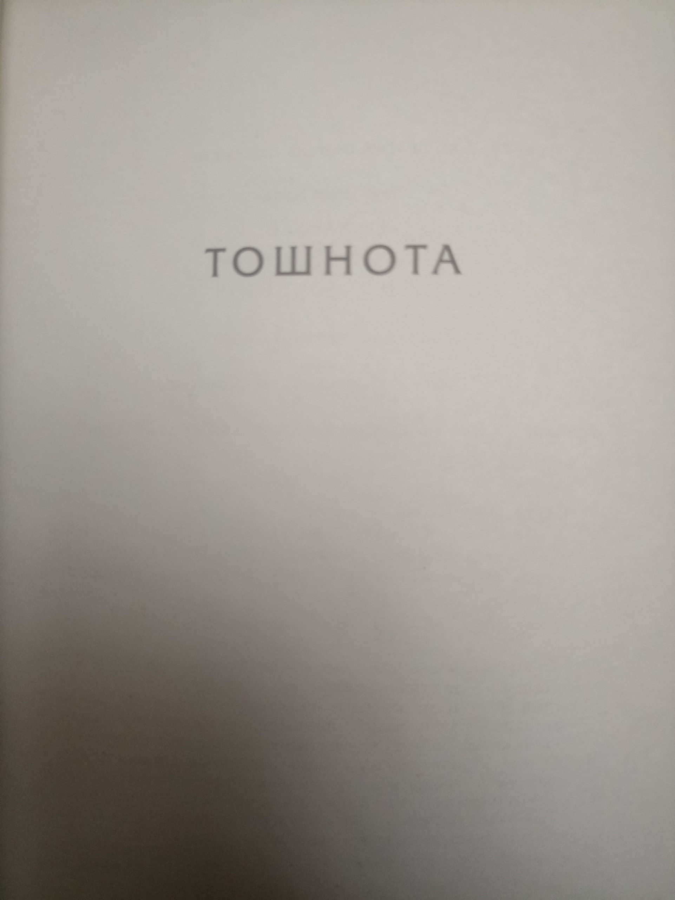
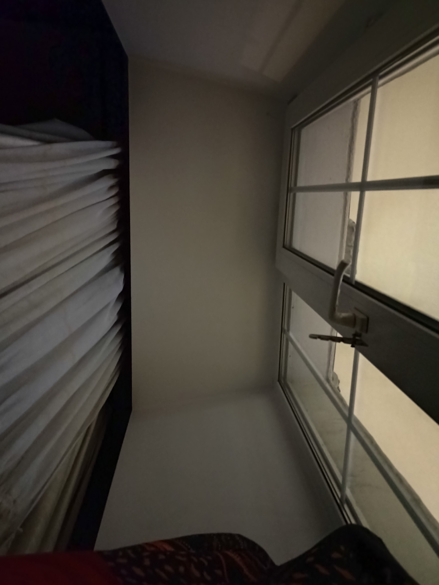

11 JAN 2026

Прочитал у него роман "Тошнота" (Наконец-то) и два рассказа: "Стена" и "Герострат"

 
Сложно оценить прочитанное. Тошнота мне при прочтении не показалась интересной и читал её я долго, но стена крайне понравилась. Но чем дальше я анализирую тошноту и пишу этот пост, тем больше мне она начинает импонировать. Значит основная прелесть этого романа не в форме повествования, а в самой идее и атмосфере. Сразу скажу, что книги сложные, а потому разбор мб не лучший, как всегда. В романе были идеи о времени / свободе и другие, которые я даже не затрону. 

 
Вообще произведения 1930-1960ых годов о поиске себя у человека, о самых низменных чувствах и отрицании традиционных канонов. Начали писать о тех страданиях, которые ранее у человека скрывались. Вот эти антропоцентричные мотивы и являются основной темой писателей экзистенциалистов. Важно понимать этот контекст, насколько близки нам эти чувства на самом деле. 

 
1) Тошнота - магнум опус Сартра. 
[Общее впечатление и содержание]
Про этот роман я раньше на середине прочтения уже писал, про чувство тошноты и внимание к деталям у героя. Чтиво без какого-либо экшена (ещё меньше, чем у Камю), состоящее чисто из мыслей и самокопания героя на протяжении 200 стр, постоянного отвращения от мира и желания избавиться от существования. Написано также сухо. Тут заметна разница с Камю, которого природа всё же восхищает и потому он допускает романтику. У Сартра этого ещё меньше, больше описания уродливых вещей в повседневной жизни (те всех). 

 
[Ощущения прочтения долгих скучных романов]
Несмотря на то, что роман не показался при прочтении мне интересным, забавно чувство, что к концу герои и их судьба всё же кажутся родными и как никак я всё же к ним проникаюсь, даже если проникаться казалось бы не к чему. Но похожие чувства я испытывал и в крупном романе Камю Чума, так что явно дело тут не в Сартре, а просто свойство длительного повествования. При этом малые формы литературы мне пока индуктивно больше нравятся (30-60стр). 

 
[Содержание чувства тошноты]
// блять как же я люблю не сохранение черновика и писать всё заново, ебанное вк
В общем, из чего состоит чувство тошноты сам герой понимает лишь на 3/4 книги. Оказывается отвращает его именно ясное ощущение существование предметов вокруг и через них чувство собственного существование. Так, внезапно налетевшее чувство существования камня в руке ознаменовало осознание существования собтвенной руки, держащей этот камень и наступила тошнота. При этом, конечно, просто понимание того, что вокруг есть вещи, и чувство их существования - вещи разные. И второе уже патологично. Отвращает существование именно из-за того, что герой также ясно понимает, что любое существование бессмысленно и потому все эти лишние формы существования противны ему, как и собственное. Герой живëт как отшельник, явно в долгой депрессии, замнкут, интеллигентен и имеет мало социальных контактов - ну прямо типичной герой для таких переживаний, не так ли? Он понимает, что хочет покончить со своим существованием, но отказывается от этой идеи, тк самоубийством привнесёт много суеты, которая также является лишним существованием - вот и всё, что его отталкивает. И он продолжает существовать, но максимально пассивно. 

 
[Об отношении героя к людям]
Я вот недавно писал, люди - те же вещи. А от вещей героя тошнит, впрочем, как и от всего существующего. Но получается, что даже особенно тошнит от людей. Нормальные люди начинают его раздражать, поскольку помимо своего активного существования они также любят существования вокруг, не ощущая его по-настоящему, т.е. пользуясь бытовым его пониманием. В общем, находятся в невежестве относительно этого чувства. Особенно отвращает его идея права, которая так нравится людям. Споры гг с другим персонажем активным гуманистом составляют важную часть романа. Спойлер: в конце концов гуманист также становится изгнанником общества, а оттуда недалеко и до тошноты, тк пропали иллюзии, создаваемые социумом. 

 
Также крайне интересна следующая мысль:
Работой нашего богатого героя было написание исторического труда об одной известной фигуре прошлого, по сути он был безработным и занимался чем интересно (имеет деньги = имеет право). Но постепенно фигура это сама по себе теряет для него интерес, даже отвращает его и он бросает это дело своей жизни. Каких-либо новых точных фактов найти не удаётся, загадка их сопоставления не решается, ему начинает казаться, что это не исторический труд, а роман. Он сам понимает, что это было абстрагированием от реальности, в результате которой эта фигура прошлого находила своë существование через него самого, он как бы существовал ради неë. Мб он сама даже никогда не существовала, но в результате работы он заставляет его существовать, возвращает к жизни. Так стирается грань между реальным/нереальным, прошлым/настоящим. Для гг этих понятий мб даже не существует. 

 
[Собственные мысли о существовании и абстрагировании]
Чем чувство существования отлично от бытового каждодневного восприятия мира? Не уверен, что я квалифицирован ответить на вопрос, но постараюсь. На бытовом уровне человек не уделяет существованию должного внимания, не задумывается о нëм. Как часто вы пропускаете сквозь себя мысль: "хм, а я ведь существую"? Я не так часто (хотя думаю сравнительно часто по статистике). Мысль кажется глупой, но по факту мы просто забываем об этом факте в результате вовсе. Так гора предметов вокруг, которая всё время продолжает существовать, не воспринимается нами как таковая - мы вспоминаем о предметах по мере надобности, а в остальное время они для нас вовсе не существуют. Так и со всем. Человеческого сознания просто не хватает постоянно держать в памяти и чувствовать существование мира вокруг, поэтому он составляет этот факт на чисто рациональном уровне где-то в памяти. Мб это даже психологический защитный механизм и вот герой попытался прорвать его (хотя вроде и неволей, просто время для развития культуры такое) . И стали ощущаться все эти наваленные вокруг и вечно существующие предметы без какой либо цели... На словах и вправду звучит противно, meh. 
Аналогичная ситуация имхо со временем. Человек не ощущает проход времени, не задумывается почти о нëм. Чтобы понять время следовало бы проникаться им на протяжении всего существования в качестве основной деятельности, что нереалистично. Этот момент кстати хорошо показан в рассказе Стена, мб Сартр тоже об этом думал. 

 
А также интересно, как это перекликается с моей текущей позицией. Может быть тут гораздо больше близкого ко мне, чем казалось. По сути я согласен, что предметы лишние, как я писал в посте с мыслями. И само понимание этого также чисто рациональное. Но чувства спокойно могут изменить эту настройку и сказать: мне хорошо от этой вещи и я хочу её больше, несмотря на то, что иного смысла, кроме как одноразового удовольствия, в этом нет. Так что само отвращение к существованию в целом имеется в каком-то смысле... Но вместе с тем как я тогда живу с этим? Я аналогично забиваю на существование вещей (это было другой главной темой в том посте) и вовсе не обращаю на них внимания, ещё менее, чем это принято у людей. И смотрю лишь на абстрактные соотношения между ними, на идеи. И вот они уже приносят удовольствие мне непреходящее, так как я нахожу их красивыми и самополезными. Хотя тут стоит заметить, что и в них какой-то самоценности нет, так что моё понимание красоты и самоценности видимо чисто культурное. В чëм прикол заниматься математикой и рассматривать абстрагированные фундаментальные отношения? Я ещë не понял, не дорос. Скорее всего и тут его никакого нет, но мысль эта страшная. По какой-то причине эти абстрагированные отношения кажутся мне более красивыми и интересными, но тогда встаёт закономерный вопрос: мб я просто не умею находить аналогичные отношения между окружающими вещами и это сама по себе сложна задача? Либо их там просто нет и тогда моя текущая идеология вполне оправданна. Где-то тут явно зарыта самая важная проблема моей жизни. И внезапно я понял, что то, что роман вдохновил меня об этом задуматься - его огромная заслуга. В некотором роде даже недавно возникла мысль об оптимистичном взгляде на вещи, как на предметы, являющиеся более сложными моделями этих отношений. Но всё же боюсь пока я их осознания все же не выдержу, вся жизнь человека - эскапизм от тяжёлого груза существования реальности. 

 
[Об интересных мыслях абстрагирования у самого героя и конец романа]
На протяжении романа раскручивается мотив любви героя к одной строй мелодии на пластинке. Сама мелодия напоминает ему о былой любви к женщине, но это не суть. В какой-то момент само прослушивание мелодии избавляет героя от тошноты. Как так, как это может быть связано? Случайность? Вскоре оказывается, что нет. Потому что впоследствие герой понимает, что мелодия эта не существовала. Если выжимкой, то получается, что он, как Платон, помещает мелодию в разряд идей вне материального мира. Тк после окончания мелодии или даже разрушении пластинки она по его мнению продолжает существовать. Btw неочевидно для материалистов, не правда ли? Но для него всё истинно так. И соприкосновение с чем-то несуществующим и выводит его из осознания существования, т.е. тошноты. И тут отсутствие по какой-то причине у него тошноты к идеям это литералли ми. Кто бы знал. 

 
В самом конце романа он идëт дальше и думает о том, кто написал эту пластинку. Представляет себе этого человека, его день, чувства. И внезапно ему впервые становится по-настоящему интересно и радостно - он хочет узнать больше об этом человеке, навести справки. И он завидует этому человеку, поскольку он существует, связанный с идеей, как бы сам став идеей в таком случае? И он решает пойти по тому же пути - он станет писать о той же исторической фигуре, что и раньше, книгу, но не исторический труд, а роман. Он напишет его таким, чтобы он был таким прекрасным, что пробуждал бы в людях истину отвращения к миру в контрасте. И через этот роман кто-то будет думать о самом гг также, как он думает о создателе пластинки. Т.е он сам уже станет идеей. А это именно то, чего он хочет - быть, в не существовать. Притом, что он понимает, что работа будет долгая и трудная, такая же не приносящая удовольствия, он все же готов пойти на этот шаг. Конец романа. Я вообще думал он убьëт себя, но ig так и вправду интереснее и глубже:)) 

 
[Оценка концовки романа]
Можно ли назвать эскапизмом решение героя? Спрятаться в идеях за пределами реальности, в чëм принципиальная разница с тем, что он делал до этого? В чем такая особенность идей, почему на них не распространяется существование? Нельзя ли стать идеей другими способами, не через науку или искусство, а через контакт с людьми? 

 
Всë это вопросы, требующие перепрочтения и дальнейшего погружения для анализа. Так что оценку идей концовки я дать не способен. Но теперь я хоть понял, что хоть сам роман и ОЧЕНЬ своеобразный по изложению и на любителя, но кайф в нëм всë же есть. По итогу новых ответов он мне не дал, тк я уже жил по тем же принципам, что и ггшка. Наверное по этому до сего он мне не казался интересным. Особенно при том, что сам герой Большую часть романа не понимал что происходит. Но всë же роман навëл на размышления и концовка даже дала некую траекторию - спасибо ему за это. 

 
2) Герострат
Одно из самых отвратительных произведений, что я читал. 
16 стр про мысли гг (стиль описания похож на тошноту), который стремится стать современной версией Герострата. Показывается человек, который не только не стремится в общество, но и ненавидит его. Он крайне противен, заставляет проститутку унижаться перед ним и всячески пытается принизить людей вокруг, чтобы показаться выше. Похоже на героя Падения Камю. Только там он не сразу пришëл к подобному. 
Идея рассказа проста - внешняя сила не меняет слабого человека. Так в один момент герой приобретает револьвер (чтобы приобрести уверенности, то бишь силы подчинения для компенсации). Учитывая его ненависть к обществу он постоянно носит его с собой и представляет как стреляет и убивает людей. Он называет себя антигуманистом. Но сам он даже не может объяснить почему ему не нравятся люди. Просто так чувствует. И он решается закончить свою жизнь (тк он всё равно понимает, что жизнь в обществе долго у него не продлится) актом, который возвысил бы его и увековечил - расстрелом прохожих, о котором он даже отправил заранее вести гуманистам. По итогу стоит сказать, что револьвер не исправил его жалкой трусливой натуры и даже преступление по-нормальному он совершить не сумел и был жалок до самого конца. 

 
По сути либо рассказ просто чтобы вызвать отвращение и задуматься о существовании таких людей, либо чтобы показать уже названную идею и продемонстрировать во что может вылиться свободное владение оружием. Второе не кажется мне интересным, первое - более менее. Главное, что согласно моим воззрениям сам этот человек не виноват и скорее вызывает жалость. Однако отвращение ко многим его характеристикам всё равно сложно не испытывать. Почему? Хм... сказать сложно. Я не считаю таким странным ненавидеть или расстреливать людей. Наверное скорее то, как он боится бороться и как он унижает других, при этом не "заслуживая" ни в какой системе статуса унижающего, если так можно выразиться. Его просто сложно оправдать, кроме как биологией. А вот мораль тут не справляется.

 
3) Стена - каждому советовал бы прочитать.
22стр - каждая страница на вес золота и как отдельный рассказ.
Буквально смаковал первую страницу оч долго, хотя мб это было из-за моего запущенного эмоционального состояния в этот момент. Но написано как-то по-другому, чем предыдущие 2 рассказал. Более просто, тепло, как-то естественней что ли. Тут герои не ненавидят человечество, не ненавидят себя, либо общество, любят жизнь. Но они вынуждены скоро её лишиться, т.к. это времена испанской гражданской войны и скоро их казнит фашистская партия. Собственно рассказ рассматривает последнюю ночь жизни героев и их реакция на осознание смерти, перевоплощение их понимания мира. Сюжет очевидно похож на концовку Постороннего Камю, где гг также ждал своей казни и рефлексировал. Многие мысли и поведенческие черты btw у этих героев совпадали: страх перед болью; не понимание что это такое, остановившееся сердце; попытка примирится со смертью. Но есть и различия, так герой Камю начинает ещё больше любить мир и хочет умереть, чтобы воссоединиться с ним и закончить судьбу, а герой Сартра просто теряет какой-либо интерес к жизни, впадает в апатию, сдаётся и превращает остаток жизни в комедию. Это более реалистично для стандартного человека. Концовка романа вообще представляет собой вселенский анекдот.
В общем, просто красиво написанный и реалистичный роман, позволяющий переоценить ценности мира, задуматься о смерти и через неё о жизни. Т.к. на войну стоит идти людям, которые уже готовы умереть.