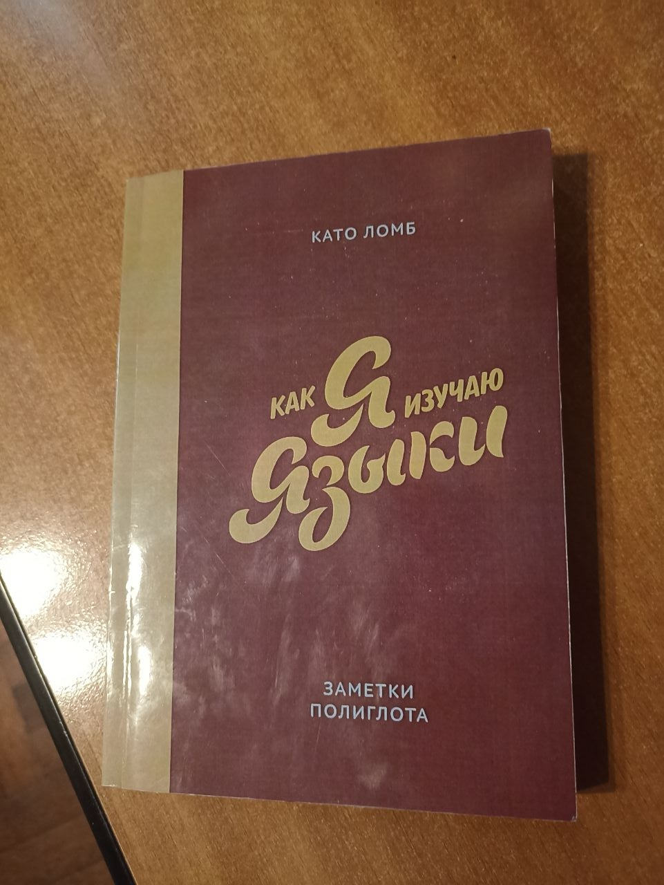
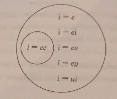

{width=400px, align=left}

## О книге
Книга 1970-ых годов от венгерской женщины полиглота середины 20 века, которая "знала" 16 языков (де факто ближе к 9-ти) и специализировалась в синхронном переводе. Здесь она в разговорном и крайне доступном стиле излагает свою историю, рекоммендуемый метод изучения языков, которым она пользовалась всю жизнь на практике, и прочие лингвистические истории и советы. В целом книга походит на что-то, что можно порекоммендовать старшеклассникам, которые увлечены изучением языков. Полезная информация и интересные тейки среди 250 стр. (правда в печати крупным шрифтом) определённо были, но в целом книга меня разочаровала и содержала уж слишком много воды и постоянных повторений. Кроме того многие выводы и техники и так всегда казались мне очевидными и давно использовались. Возможно дело тут в том, что с момента написания книги прошло 55 лет и многие из этих техник уже банально стали общепринятыми. Однако книга не бесполезна и чтобы создать настолько лаконичную и логичную выжимку её содержания насколько я могу, я перечитал её во второй раз с выделением каждой идеи и дальнейшим их анализом.

Чаще всего упоминание Като Лобм в интернете я встречал в связи с её "десяти заповедями" в отношении изучения языков, которые представляют собой крайне короткие представления некоторых из её идей и формулируются в этой же книге ближе к её концу. По моему мнению именно эти 10 правил это самая кринжовая часть книги, плохо объясняющие что Като имела ввиду на самом деле. Они также плохо интерпретируются различными поверхностными популяризаторами. Обращать на них внимание не стоит.

Дописывая этот фрагмент в конце процесса написании статьи, могу сказать, что благодаря созданным мною заметкам я смог изложить в этом посте > 80% интересной информации всей книги. Мне это кажется крутым. С технической литературой такое никак не провернёшь :)

## Исторические предпосылки изменений в изучении языков

Я постараюсь переизложить главные идеи Като в наиболее связанном порядке. Начать стоит с предпосылок к предлагаемого ею метода — т.е. с весьма интересных исторических подробностей. С рождения мы все знаем хотя бы один язык, но зачем изучать чужие языки? Кто их изучает? Като приводит первый исторический пример, начиная с моих любимых греков. А точнее с их захвата. Когда Рим покорил Элладу, то известно, что развитая греческая культура начала подавлять римскую и образованные римляне считали латинский язык непристойным и всячески стремились приобщиться к литературе и языку захваченных греков. Следующая цитата римского поэта Горация встречается повсеместно:

> «Греция, став пленницей, победителей диких пленила,
В Лаций суровый внеся искусства».

В попытке как-то обучить себя греческому (во времена отсутствия наличия римлян педогогов греческого) богатые граждане использовали своих греческих рабов, свобождая их от ручного труда и заставляя их преподавать им свой родной язык так, как они могут. Потом греческий стал преподаваться в римский школах вместе с тщательным изучением греческих литературных шедевров как пика культуры.

В более поздние времена христианства, однако, фокус интереса к языкам в развитых странах остался на мёртвых. Так в школах учили всё тот же древнегреческий и латынь, хотя на них уже вовсе никто не говорил. Более того это даже был основной фокус гимназий. Целью такого обучения было с одной стороны всё также приобщение к классике, а с другой — эллитизм, выделение высокой касты людей, которые выделяли друг друга в том числе по знанию этих высоких языков. Т.е. язык не выполнял своей основной функции, передачи информации между живыми носителями. Поэтому в фокусе было тщательное изучение грамматики и зубрёжка всевозможных исключений, а на фонетику и вовсе забивали, т.к. языки почти не употребляли в речи. Да и в целом после выхода во взрослую жизнь большинство языками этими пользовались мало, потому и средним обучающимся был подросток-молодой человек.

Как обстояли дела с изучением других, живых языков? Их учили лишь отдельные профессии, где это было практически полезно: торговцы, дипломаты, врачи, миссионеры. Но обычный человек не стал бы учить язык какой-то соседней страны, это было почти бесполезно. Однако современная глобализация всё изменила. В основном именно с приходом 20 века (и даже после второй мировой) для среднего человека перестало быть редкостью изучение дополнительного языка. Причём это изучение имело именно практический, а не научный или культурный характер, ведь этому уже способствали тесные контакты между странами, а впоследствии и дистанционная работа. Это в свою очередь означает 3 следующих крупных изменения: 

- возраст среднего обучающегося смещается с молодого поколения на 30-35 лет. 
- возрастает значение фонетики и снижается фокус на грамматизацию.
- постепенно появляются новые технологии, которые влияют на способы изучения языков.

Как человек и переводчик, живший в центре вышеописанных перемен, Като, конечно, была крайне озабочена ими. Потому она, хоть и не будачи проф. педагогом, пыталась в этой книге обратить на них внимание и предоставить свой взгляд на адаптацию методик изучения языка.

## Основные идеи

Тут я перечислю, как мне кажется, самые фундаментальные из тех идей, которые Като описывала на строчках в разных частях своей книги. Из их понимания, как мне кажется, как раз и строится её метод.

### Взрослые и дети имеют разный набор способностей и учить языки им следует по-разному.

Дети начинают, как любят говорить, с чистого листа. Они не знают никакого языка — окружающий мир и слова для его описания они познают одновременно. И времени на этот процесс у них конечно немеренно. Для выросшего человека ситуация совершенного другая: и времени у него нет, и слова для описания мира у него уже присутствуют в голове. А значит новым языкам придётся конкурировать с ними, изменять привычные правила пользования языком. Во взрослом возрасте изучения языка уже имеет осмысленных характер, приходится заучивать непривычные нормы и исключения, соотносить их с известной уже информацией о мире. Из-за этой же разницы в изучении языка для детей и взрослых следует и то, что нативы (носители языка), вопреки распространённому заблуждению, плохой выбор для учителя иностранного. Они полезны для отработки фонетики и разговорного английского. Но чему может научить о своём языке человек, который сам пользуется им интуитивно без знаний формальных правил? Ничему, поэтому для этого в первую очередь и необходимо специальное образование.

в общем, налицо крупное различие в этих двух вариантах условий для знакомства с языком. Существует метод Берлица, который предлагает изучать язык без посредства родного через заучивание полценных фраз с самого начала и изучение смысла иностранных слов без перевода посредством жестов и картинок. Като упоминает об этом методе  (появился он в 1878г.), но оценки ему не даёт. Однако на этапе теории такой метод кажется глупым, т.к. он как раз низводит взрослого человека до ребёнка, заставляя его изучать язык полностью обособлено от уже изученного. Но ведь знание родного языка для взрослого человека это вовсе не слабость, а сила. Это тот компонент, который в совокупности с пониманием деталей окружающего мира и делает взрослого более эффективным учеником, чем ребёнок. Като предлагает этим преимуществом пользоваться по полной и не выставлять из себя детей. Чуть позже я вернусь к этому.

### Польза усилий в работе памяти

Крайне простая и очевидная мысль, практически проверенная: лучше запоминается то, на что мы обратили больше внимания, затратили больше усилий на понимание. К тому же, при успешном решении задачи/загадки, на которые человек потратил усилия, он получает естественный всплеск эндорфинов, который вознаграждает его и поддерживает его мотивацию заниматься языком. Из этого Като делает вывод, что к изучению языка не стоит подходить как к бездумной зубрёжке даже при изучении новой лексики по словарю — нужно постоянно держать мозг в небольшом напряжении, постоянно анализировать, сравнивать и думать. Именно этот процесс позволит более устойчиво запомнить информацию. 

Вот некоторые практические применения этой идеи:

1) Когда требуется найти забытое слово или какой-то перевод по словарю, не стоит сразу открывать нужную страницу. Попытайся сам вспомнить все ассоциации, улики, хотя бы часть корня. По этому корню уже поискать информацию, вспомнить похожие слова и в статьях о них найти ссылки на нужное. В общем, затратить больше усилий.

2) Это и так крайне популярная методика, но Като соглашается тем, что полезно составлять собственные словари, где слова были бы расположены неупорядоченно, а помимо переводов слов учащийся бы записывал какие-то сравнения, свои ассоциации.

3) Като очень любит использовать иностранные книги в изучении языков с самого первого дня обучения. Именно обычные художественные книги, а не учебники, вы не ослышались. Об этом также позже, но связь с этим пунктом в том, что чтение книг на полностью неизвестном языке и попытки разобрать по ним значения слов и неизвестные правила синтаксиса, морфологии как раз создают множество загадок и заставляют обучающегося потратить больше усилий.

Таке замечу, что Като недовольна влиянием современных технологий на людей в том смысле, что они явно делают человека более ленивым. Ведь теперь нам приходится в целом по жизни прикладывать всё меньше усилий и мы к этому привыкаем. Конечно хочется просто смотреть телек/ютуб и через сотни часов прослушанного контента запоминать встречаемые слова, а не дотошно разбирать их в разных случаях, составляя свои изысканные примеры. Но Като как раз требует создания себе дополнительных хлопот ради добавочного эффекта. Хотя для современного человека это может быть непривычным.

### Польза ассоциаций и контекста

Контекст с лат. означает что-то вроде сплетения, ткани. Это отражает то, как слова в тексте всегда находятся внутри контекста, как отдельная нитка состоит среди множества в их общем сплетении. По отдельности же их рассматривать смысла мало. Крайне полезно при изучении лексики добавлять контекст во фразы, чтобы понимать как по-настоящему используется слово. Кроме того, таким образом создаются ассоциации - второй, наряду с дополнительными усилиями, инструмент, который позволяет держать слова в памяти. Так по самому контексту уже должны всплывать в памяти часто употребляемые в нём слова. Ассоциации это именно то, что связывает в нашей голове слова друг с другом и позволяет как-то найти потерявшийся кусок.

Да и в целом, связанные слова также нужно учить вместе, чтобы возникали ассоциации. 
С этим я полностью согласен и мне нравится учится синонимы одной пачкой, например, недавно учил разные слова на eng для описания свечения с выделением их особенностей в коннотации и значениях: shine, glow, twinkle, flicker, shimmer, gleam, glimmer, glare, glisten. Явно тяжелее запомнить их по отдельности, тем более учитывая их малые различия. Также полезно одновременно учить слова с их антонимами, омонимами, часто используемыми в комбинации словами. Так, если я захочу вспомнить как по-английски будет "в крапинку", то я вспомню, что узнал это слово из заголовка истории о Шерлоке Холмсе, где крапчатая повязка означала змею и вместо со словом band автоматически вспомнится и полное словосочетание speckled band.

Здесь также может скрывать ответ на вопрос почему в сравнении со словами имена запоминать сложнее: у них нет связи с другими словами. Они изолированны и связаны лишь с предметом. Вывод - для них также нужно искать дополнительные связи, ассоциации. 

В этой связи зададимся вопросом: "Какие слова запоминаются проще?" — те, которые имеют более сильные субъективные ассоциации, моменты запоминающие их, чьи аналогии чаще используются на родном языке. Однако есть иерархия и в целом по частям речи — чем конкретнее описываемый предмет (отношения), тем проще: существительное конкретного предмета -> прилагательные об ощутимых свойствах -> отвлечённые существительные -> глаголы конкретных действий -> ... -> глаголы отвлечённых действий (выполнять, обеспечивать, ссылаться). Из этой приведённое иерархии сложности видно, что глаголы являются самой сложной для запоминания частью речи. Также одной из причин сложности запоминаний глаголов может быть и то, что они самая изменяемая часть речи. 

---

Применение всех трёх пунтов можно увидеть на следующем примере:
Особенность культуного багажа взрослого человека позволяет ему строить ассоциации не только внутри одного языка, но и со словами между различных языков. Где-то они будут совпадать и учить ничего не придётся, а где-то можно будет заметить отличия и также запомнить слова через них. Часто бывает так, что слова различаются, но при этом в разных языках имеют одинаковое множество смыслов. Так и в английском, и в русском земля и Земля это одно и то же earth и Earth (Таких примеров и получше я встречал множество, но самому их вспомнить у меня произвольно не получается). Понятно, что существуют ложные друзья переводчика и экстраполяция своего языка на другие часто оканчивается неудачными результатами. Однако всё же таких связей немало и глупо было бы о них забывать. В целом экстраполяция характерна для взрослого человека и является как положительным, так и отрицательным эффектом. Замечу также, что мешает она больше при изучении второго иностранного, т.к. экстраполируются сознательно выученные правила из первого иностранного, которые сидят в голове прочнее, чем формальные правила родного.

В общем если связь есть, то нужно ей пользоваться. Полезно это в особенности при изучении не столько лексики, сколько правил языка. Ведь в языках они структурированны и различаются и стоит потратить дополнительно усилие, чтобы сравнить порядок слов или грамматические правила между известными языками, что позволит лучше понимать их оба. Вот цитатка Ницше по этому поводу: 

> «Тот, кто не знает ни одного иностранного языка, не знает и своего собственного»

## Метод изучения языков от Като Ломб

Като настойчиво утверждает, что никаких невероятных секретов для сверхбыстрого изучения языков не существует. Но есть улучшение классических техник, более рациональное исследование времени. Её предлагаемый метод использовался ею в течение всей жизни при самостоятельном изучении языков и исходит из всего вышеописанного мной. 

Я уже упомянул, что в 20 веке возраст изучения языков сместился на человека средних лет, а значит изменились и условия для изучения языков — у взрослых людей мало свободного времени. Обычно график уже полностью занят. Като делит сутки на три восьмёрки: 8 часов сна, 8 часов работы, 8 часов отдыха и развлечений. Откуда брать время? Очевидно не ото сна (хотя Като и упоминает гипнопедию) и редко что-то дельное получается устроить в разделе работы (хотя если получится, то профессиональные знания и интеграция в работу могут стать ключевыми помощниками в овладении языком). А значит изучению языков лучше всего быть каким-то развлечением, при этом имеющим некоторую интеллектульную нагрузку. Как идеальное решение возникшей проблемы автор приводит книги. Книги легко подобрать под любой свой интерес, они фокусируют на себе внимание, развлекают и содержат неиссякаемый запас примеров использования языка его носителями. При этом, что для меня было вовсе неслыхано, Като предлагает начинать иностранные книги в оригинале (или лучше адаптированные) с первого дня изучения языка, вместе со словарём. Идея в том, что первые навыки языка можно получить даже смотря на незнакомый язык в словаре, подмечая там правила морфологии, произношения через транскрипцию. Далее их можно находить и в книге и по ней пытаться угадать грамматическое устройство языка и медленно продвигаться уже по самому тексту.

На примере выдуманного азильского языка Като предлагает следующую последовательность действий:
Купить крупный словарь язильского. Пользоваться им как учебником, выявлять по нему правила языка. Помогают международные слова. Подметить как образуются разные части речи, как работает фонетика. Это проба языка на вкус. 
После этого покупается учебник и художка на этом языке. За ошибки в учебнике себя ругать и прорабатывать их, но сразу прощать. Но это дело скучное
Поэтому нужно сразу начинать читать литру. Если есть, то начать с адаптированных текстов. Лучше подходят современную лёгкие романы и литература по интересам. Читать по нескольку раз. Сначала выписывать лишь те слова, которые были понятны. При чтении сначала лучше для интереса читать без излишней скрупулезности,  не пользуясь часто словарём. Затем уже перечитывать, наоборот во всём сомневаясь и проверяя грамматику автора. 
Но всё это не покрывает потребности в фонетической части языка. Поэтому следует разузнать график радио программ на этом языке. Отсюда можно взять и лексику, и образец произношения. 
Хорошо бы, конечно, также найти препода по языку, чтобы исправлял твои ошибки. Лучше у женщин, мол с ними легче находить контакт.

Такой метод эффективен ещё и тем, что он создаёт микроклимат иностранного языка. Часто люди советуют поехать в другую страну, чтобы окунуться внутрь языка — это макроклимат. Но де факто сам он не обязателен, какая разница сколько иностранного вокруг тебя? Важно лишь то, чтобы ты постоянно контактировал с иностранным. А для этого достаточно и микроклимата — пользования иностранными ресурсами, просмотр видео, чтение иностранной литературы и т.д. При этом это гораздо более доступный метод. Для развития фонетика Като рекоммендует внутренние диалоги, разговоры с самим собой вслух. Это вовсе не так странно, крайне доступно и приучает думать на иностранном языке. Я этим пользовался уже давно и часто. Главное тут не разговаривать бездумно, закрепляя свои ошибки, а пытаться исправлять непоставленные звуки, имитировать речь носителей, подбирать верные выражения.

Ещё немного про переоценку необходимости поездки заграницу: нужно ли знакомится с культурой и историей языка, страной? Да, полезно. Но по менению Като этому уделяют слишком много внимания. 
Все рекомендуют обязательно поехать на родину языка. На самом деле само по себе пребывание в стране тебя ничему не научит. Вывески вокруг дадут мало, разговоры с прохожими также. Аналогичный труд дома дал бы похожие плоды. Чтобы получить пользу нужно активно пользоваться возможностями — искать мероприятия, выставки, ходить и всё изучать со словарём. Так Като за 3 дня в СССР побывала в кино 17 раз :) Наиболее плодотворным будет продолжительный контакт с азильцами, которые разделяют твои интересы и готовы исправлять твои ошибки. Также на полезность заграничной поездки громадно влияет уровень знаний. Мало что от неё получит тот, кто итак знает всё, и тот, кто знает слишком мало. Получается, что наибольший эффект получит +- троешник.

Если кто-то сомневается в мощи книг, то вот ему пример: в каждом тексте находится целое море знаний, "весь язык". Так, Като приводит пример истории заключённого, который выучил английский по 16ти строчкам Шекспира. Можно перечитывать и перечитывать, разбирать, выделять и узнавать постоянно что-то новое. Деньги любят счёт, а книга – карандаш, поэтому не стоит бояться делать множество своих пометок. 

    
    <figcaption> цитата одного средневекового легендарного полиглота, знавшего по дошедшей информации более 50ти языков.
 </figcaption>

Но всё же конечно главной фишкой в изучении языков, как и везде, является увлечённость. Помешанные люди добиваются своего. Так Като рассказывает, что жила языками, читала постоянно, в течение всех суток. Себе она в качестве подарка покупала словари рандомных языков. И не дай бог кто-то оставит иностранную книгу лежать на столе — Като взяла бы её и прочитала раза 3 минимум. Как-то так, впрочем, она и выучила русский :) 

## Всякие интересные факты о языках

### Особенности изучения языка в качестве хобби

Написана была идея о том, что изучение языков является одним из лучших хобби хотя бы потому, что это одно из немногих, что полезно изучать даже поверхностно. Любое количество изученного языка, даже сотня слов уже может быть полезна для общения. И знание этих слов у человека только начавшего изучать язык будет не сильно отличаться от их понимания экспертом. Это сильно отличается от научных знаний, где можно долго копать вглубь и ремёсел, где всё равно можно долго улучшать свою технику. P.S. Наверное это связано всё же именно с тем, что тут Като рассматривает владение языком как чисто практический навык. Причём у этого навыка и вправду не особо высокая глубина, разве что фонетику можно подтягивать.

Более того, в отличие от научных знаний при изучении большинства языков ничего открывать не нужно. Все необходимые знания уже открыты и легко находятся на просторах интернета. А значит можно быстро утолить возникающее любопытство и найти ответ на любой вопрос. Это приятные свойства этого хобби.

Также Като замечает, что согласно исследованиям способности к изучению языков почти не снижаются с возрастом, а потому их можно учить в любом возрасте. Лично у меня была репетитор по французскому, которой было лет 75 и она начинала только начинала учить китайский. Да и сама Като перед смертью в пожилом возрасте приобрела интерес к ивриту. Тем более это полезно тем, что позволяет противопоставлять деменции как хорошая интеллектуальная нагрузка, в том числе на память.

Из некоторых обозначенных автором неудобств этого хобби можно отметить то, что в сравнении другим профессиям не нужно постоянно переучивать свои знания. Ведь приходится постоянно учить, что книга это не книга, а book или libre. При этом еще и не забывать старого варианта! Это конечно дополнительная нагрузка на память и весьма непривычно.

Btw вот рандомный забавный факт (уж не знаю о его правдивости): фиксированы исторические случаи, когда в результате травмы мозга человек полностью забывал выученные языки, а родной сохранял. Также известен случай, когда человек перед смертью начал говорить на уже давно забытом родном языке. Так что работа памяти это штука интересная.

### Не существует особой способности к изучению языков

Прямых талантов к изучению языка не существует. Формула результата:

> результат = потраченный труд + мотивация. 

Общей способности нет хотя бы потому, что разные языки разным людям даются с разной сложностью. Так часто Като слышала в среде переводчиков, что кому-то один язык дался с лёгкостью, а другой всё никак не даётся. А у другого уже наоборот. Дело тут в личной совместимости с языком и количестве интереса, мотивации. В целом же для изучения языков нужно 3 навыка: хорошая лексическая память, умение подражать звукам, логическое мышление. Поэтому одним людям языки в общем будет изучать легче, чем другим, т.к. у них, например, банально гораздо крепче память и способность на слух различать звуки. Но сложно назвать что-либо из этого особым навыком или талантом. Тем более, что эти вещи развиваются. Даёт надежду и то, что по мнению Като более важную роль играет по-прежнему не способности, а подход к изучению.

### Различные типы языков по свойствам морфологии

Като Ломб приводит деление языков на 3 категории: агглютинирующие, изолирующие и флективные.
Поскольку я совершенно ничего не знаю о теоретической лингвистике, то это для меня интересная информация. Это всё разные способы видоизменения слов для добавления им лица, числа, падежа, времени и т.д. Агллютинирующие языки прикливают к корню слова дополнительные части из крупного их набора (что отражается в названии этого типа). Причём обычно каждая часть отражает какую-то конкретную функцию, допустим, переводит слово в множественное число или имеет значение "приближение". Примеры таких языков: Турецкий, Финский, Венгерский, Японский, Корейский, Суахили, Эстонский (Списки брал из Deepseek). По итогу в турецком может получится такое слово: 

Avrupa + lı + laş + tır + ıl + ama + dık + lar + dan + mış + sınız  
Европа + житель + становиться + заставлять + быть + невозможность + относительное прич. + мн.ч. + из + якобы + вы (мн.ч.)  
"Поскольку вы те, кого якобы невозможно было сделать европейцами..."

В венгерском же, как я понял, корни имеют по нескольку значений, которые меняются в зависимости от приклеиваемых суффиксов (звучит очень неприятно).

Изолирующие языки почти не трогают основы слова, а для вплетения его в нужную форму используют внешние по отношению к слову приёмы: строгий порядок слов, добавление тонов, вспомогательные слова. К таким языкам относятся китайский, вьетнамский, тайский, бирманский, английский (вспомните только сколько там специальных частиц для образования времён). Но, ясное дело, язык не будет чаще всего строго попадать в одну из категорий. Это лишь обозначение его основного поведения.

Флективные языки используют добавление к словам частиц, которые имеют сразу множество значений, также смену самого корня, часто имеют поэтому множество исключений. Примеры: русский, латынь, немецкий, арабский, греческий, французский, санскрит. 

### Нет лёгких языков, все сложны.

Исходя из предыдущего деления языка по типам морфологии может показаться, что флективные языки самые сложные, а изолирующие простые. Да и часто можно встретить мнения о том, что английский и итальянский крайне простые, а китайский и арабский это сложнейшие языки. Автор называет это заблуждением, связанным с видом кривой роста. Если нарисовать графики успеха в языке от потраченного времени, то кривая для английского будет выпукла вверх, а для китайского вниз. Т.е. вероятно правда то, что войти в изучение английского проще, но то же нельзя сказать про освоение его до конца. Как говорится, получить мастерство везде одинаково сложно. А Като Ломб очень чётко отличает понятие "знания языка" от умения владеть им в какой-то мере. Так она приводит мнение "Как прост английский язык! Да, в первые 10 лет прост, а вот потом...", что показывает как бы уровень владения, на который она нацеливается. И тут я, пожалуй, с ней соглашусь. Ведь сложность языка в одном месте компенсируется лёгкостью в другом. Так в флективном языке наподобие русского смысл слова можно понять и в отделении его от предложения, а над порядком слов в предложении и вовсе задумываться почти не требуется. В английском же из-за бедной морфологии приходится запоминать больше вариантов корней, париться с порядком слов и вспомогательных частиц, а также с фразовыми глаголами, которые заменяют в какой-то мере словообразование. Чёртовые фразовые глаголы! Все эти ваши go away, go back, go by, go down, go for, go in, go into, go off, go on, go out, go over, go through, go under, go up, go without. 

Насчёт языков с необычным алфавитом: стоит считать, что это сложность никак не увеличивает. Многих пугают иероглифы или неизвестные буквы, но изучения алфавита это обычно самая простая часть языка, с которой можно справиться за пару недель. Иероглифическая письменность имеет и свой плюс: по виду иероглифа можно догадаться о его смысле. Так в алфавитных языках это невозможно (Като приводит пример названий деревьев на немецком, где слова совершенно не похожи друг на друга. В китайском же все они имеют общий элемент, отражающий то, что иероглиф обозначает какое-то дерево). Мне кажется тут это несколько похоже на корни слов в алфавитных языках. Но в иероглифических функциональность их видимо выше.

{width=300px, align=left} 
Если же всё же присутствует какое-то стремление к ранжированию языков по сложности, то Като утверждает, что логичнее всего было бы называть те языки сложнее, где радиус действия правил минимален. Т.е. те языки, в которых наибольшее количество исключений и алогичности. Этот ответ исходит из того, что правила, хоть и требуют прилежного обучения, но дают мощный инструмент для свободного пользования языком, а значит упрощают его. И, что удивительно, исходя из подобной точки зрения мы получим, что английский язык очень сложный (ну или хотя бы фонетически). Фонетика в нём крайне алогична. Узнать как читается слово по его записи сложно, т.к. исключения очень частые, и один и тот же звук записывается множеством вариантов. Буквально пару дней назад на просторах интернета увидел интересный пример этого: во фразе "Pacific Ocean" все 'c' читаются по-разному. P.S. от себя добавлю, что полное отсутствие правил сложнее частичной алогичности. Так, например, в китайском узнать как читается неизвестный иероглиф вовсе невозможно :)

В общем, какой бы язык не был выбран, и с ним придётся рано или поздно сильно запариться. Где-то правил будет больше, где-то меньше. Однако же чем меньше правил в языке, тем сложнее бывает найти верную форму их применения для описания своих мыслей. А ведь это главная задача языка!

### Нет более выразительных языков, все хороши.

Повторю ту же мысль: язык развивается естестественным образом для восполнения нужды в передаче информации между людьми и делает он это весьма долго, постоянно развиваясь. Поэтому любой старый язык является хорошим инструментом и достаточно выразителен для передачи почти любой желанной мысли. Иногда тем ни менее говорят, что одни языки полнее других. Так часто упомянают выразительность русского с огромными возможностями словообразования (конечно, это ведь флективный язык) и огромное количество лексики в английском. Като приводит много примеров того, что языки могут отличаться по своей выразительности не в общем, но в отдельных областях, связанных с культурой народов. Тут идея простая, вспомнить только тот факт, что у чукотских племён в языках 10+ названий для снега. Из того, что Като приводила могу вспомнить то, что в венгерском есть форма слов, которая различает действие, выполненное кем-то, и действие само по себе. В целом логично, что можно рассматривать революция чью-то и революцию как концепт :) В современном немецком нет разделения между уметь и мочь (can и might в англ., к примеру). Эту разницу ловко использовал в своём ответе Бернард Шоу плохому переводчику на просьбу взяться за перевод своей пьесы:

>  "you may, but you can't". 

И в каждом языке есть такие фишки, этим в том числе и интересна лингвистика. 

Стоит также затронуть и всяческие оценки красоты языков. Като приводила умело написанную поэзию и на венгерском, и на немецком, ласкающую слух. Не то, чтобы меня это убедило подобно аргументам про сложности языков, но я соглашусь с тем, что каждый язык может быть красивым. Более того автора высказала классную мысль о том, что красота слова для носителя определяется не столько звучанием, сколько значением. Так слова фиалка и фискал очень похожи по звучанию, но имеют совершенно разные коннотации, а потому и звучат соответствующе.

### Кажущаяся алогичность языков

Если кто-то и говорит, что какой-то язык алогичен, что в нём громадное количество исключений и непонятно откуда взявшихся правил, которые все нужно заучивать, то стоит принимать его слова следующим образом. Полных алогичностей и случайных исключений в языках нет. Т.е. сам процесс развития языка может и можно назвать по большей части случайным и непредсказуемым, но у большинства исключений и подобного есть чёткие обоснования и причины, которые выявляются при изучении истории языка.

Вот факт, который мне показался просто забавным. Като приводит интересный пример разделения корней нормандского и англо-саксонского в английском: почему для одних и тех же животных есть по 2 названия с разными корнями для них самих и для их мяса? Исторические причины этого находятся в роли соответствующих народов в тогдашней иерархии. Животные взяты от англо-саксонской низкой касты, которые ими заправляли: calf (нем Kalb), swine (нем Schwein), ox (нем Ochs). Потребетелями мяса же были завоеватели: veal (фр veau), pork (фр porc), beef (фп boeuf) 
Отсюда случаются парадоксальные ситуации, когда немец в Англии сможет лучше понимать необразованных граждан, т.к. те говорят с большим количеством германских корней. 

### Исключения появляются там, где слова чаще всего используются.

    
    <figcaption> Примеры того как спрашивать о времени, kinda ложащиеся на теорию используемости. </figcaption>

Вот очень понравившаяся мне мысль: часто используемые правила снашиваются также, как часто используемые предметы. То есть исключения появляются в основном в самых распространенных словах. Так, почти все неправильные глаголы в английском входят в топ по частотности. И вправду! Получается они исказили свои формы именно от частого употребления. 

В сравнении с этими общеупотребительными в бытовой речи словами научная лексика имеет международный характер и почти неизменна в разных языках. Хотя я бы и объяснял это скорее тем, что в современности уже нарочно проводились попытки стандартизации терминологии.

### Подход к языку должен отличаться для учеников из разных стран

При изучении языков стоит исходить из того откуда ты и какие языки уже знаешь. Очевидно, что одни языки, похожие с уже знакомыми тебе, будут покоряться проще. Так многие языки Европы имели предком латынь и относятся к романской группе. Поэтому европейцам проще учить друг друга. Впрочем, относится это к любым общим языковым семьям. Почему важно помнить о своих имеющихся знаниях и после непосредственного выбора языка? Затем, что в зависимости от этого нужно будет обращать внимания на различные разницы в основах знакомых и изучаемого языка. Потому Като говорит, что нужно изучать языки по учебникам родных стран, т.к. у разных народов будут разные проблемы и учебник должен учитывать систему мышления обучающегося. Это рушит распространившееся мнение о том, что стоит брать за основу иностранные учебники иностранного. Пожалуй, лучшим учебником будет тот, что написан для твоей страны, но на иностранном языке. Плохо брать иностранные учебники ещё и вот почему: возьмём, к примеру, что ты захотел из России изучить английский и купил учебник для английских детей. Несмотря на то, что это может быть учебник за 1 класс, для тебя там будет множество непонятной лексики. Ведь уже в 7-8 лет английский ребёнок несмотря на своё невысокое по сравнению с взрослым человеком развитие уже будет приближаться к взрослому англичанину по размеру словарного запаса и англичане будут использовать всю эту лексику с самого начала в своих учебниках! А тебе придётся туго, читая детский текст про какого-нибудь пастуха, подбивающего кобылам подковы.

Мельком упомяну и то, что языковые различия нужно учитывать и в переводе. Главное в переводе – создать нужный образ, не важно какими средствами. Тупой перевод обычер недостаточен, поэтому туго приходилось ранним технологиям машинного перевода, базирующихся видимо на каких-то таблицах соответствия слов, созданных вручную. На эту тему есть множество анекдотов, когда машины совершенно не понимали фразеологизмы. Но и сейчас люди много опережают нейронные сети в художественных переводах, ведь тут в идеале важны оттенки и культурные различия, которые непонятно как объяснить машине. На этот счёт Като отдельно привела историю из своей карьеры, где она была переводчецей на выступлении во время праздничного банкета где-то в Европе японского дипломата. Он попытался показать свою близость к народу и начал с того, что пожаловался всем, что всё детство ему приходилось питаться крабами. Естественно, для нас, европейцев, это ещё тот деликатесс. Даже если перевести фразу точно, то из-за культурных различий смысл будет утерян. Поэтому Като в своём переводе сказала, что ел он всё же не крабов, а похлёбку.

### О фонетике

Като, как и принято, разделяет любой язык на 4 сферы: письмо, чтение, аудирование и говорение. Причём она много раз повторяет, что для настоящего знания языка знать нужно каждую. Напомню, что я описывал в исторических предпосылках, что на фонетику большую часть истории изучения языков забивали. Во времена Като появилось радио, что облегчило тренировку без носителей. Сейчас же у нас всё ещё на порядок легче, ведь имеются бесчисленные видеоматериалы от носителей. Теперь забивать на фонетику это и вовсе грех. Btw фонетика ( да и языки в целом, я б сказал), лучше получаются у женщин. Като находит объяснение в том, что они менее стеснительны и обладают большей готовностью к мимической игре. А это и нужно для хорошего произношения – отсутствие страха ошибок и умение различать звуки на слух. Да, хорошего и музыкального слуха для этого вовсе не нужно, нужны базовые различительные способности. Также Като напоминает, что простого слушанья иностранной речи недостаточно – нужна муштра (drill)! Активный анализ, повторение и мозговые усилия требуются и тут, иначе всё прослушиванье будет без пользы.

Интересным фактом в этом параграфе то, что отдельные звуки также могут иметь своё межъязыковое значени. Так в совершенно различных языках прослеживается поразительная тенденция использования звуков в словах с похожим значением: 'и' в ласковых и уменьшительных словах, 'р' в переводах словах, передающих гром. Напоминает мне тест Буба-Кики.

### Об особенностях работы переводчиком

Обычно люди представляют, слыша профессию переводчика, переводчика литературных текстов. Однако у профессии переводчика существует богатое разделение. Кроме литературного перевода можно зная языки заниматься преподавательской деятельностью и устным переводом. Причём каждое из трёх направлений имеет свои особенности и специальные требуемые навыки, так что можно найти под себя. Като занималась всеми тремя направлениями, но больше ей нравился перевод устный, в котором можно выделить следующие профессии: линейный переводчик, дипломат, синхронист. Като была синхронисткой и переводила на множестве крупных заседаний. Рассказывала она и про множестве случаев в своей долгой карьере и про условия труда. Так синхронные переводчики на крупных собраниях обычно работали в специальных закрытых будках в командах по 4, постоянно подменяя друг друга. Причина подмена в том, что устный перевод это **невероятно** стрессовая работа. Оно и понятно – тебе нужно переводить точно, и одновременно с этим времени на раздумья и паузы почти нет. Так что усталось подходит очень быстро. Пожалуй я сам бы никогда не занялся синхронным переводом – уж слишком это волнительная работа.

Одной из понравившихся мне историй была связана со сложностью перевода с немецкого языка. Оказывается в немецком отрицание ставится последним словом в предложении. Это постоянно создаёт казусы, когда переводчику приходиться дожидаться конца какого-то сложноподчинённого предложения весьма долго время, только чтобы понять отрицается действие из самого начала или нет :)

Като приводила и некоторые советы для своих начинающих коллег. Например: также полезно для устной речи (особенно переводчикам) учить заполняющие вводные слова и готовые заполняющие фразы наподобие:

> Очень, конечно, главным образом, наверняка и положение дел таково, что... Хотелось бы подчеркнуть, что... Однако в то же время... Стоит обратить внимание на то, что....

 Ими можно автоматом заполнять паузы в речи для получения времени на раздумье + звучать умнее :)))

Ораторам же Като передавала честную просьбу оставить заготовки речей и пытаться выражать свои мысли менее запутанно и как можно более проще. Т.к. нечестно ведь получается, докладчик заранее подготовил какую-то чрезвычайно запутанную речь, а переводчику всё это адаптировать нужно в реальном времени. \*skull emoji\*
