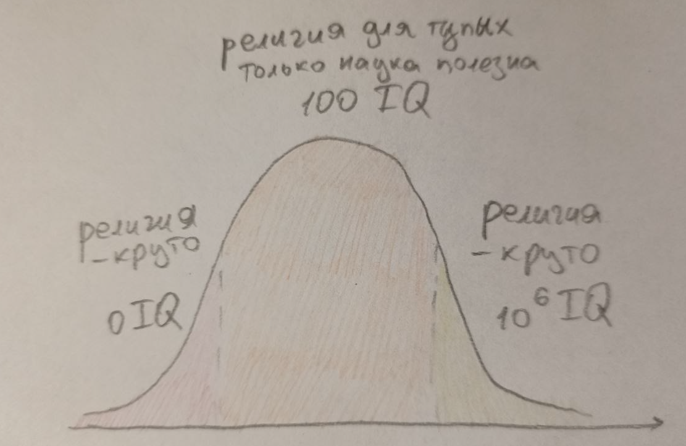
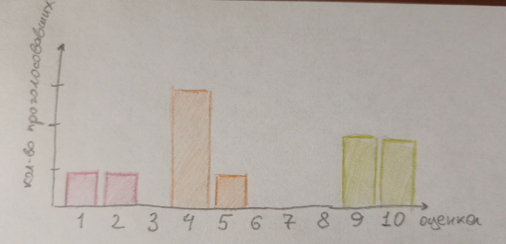
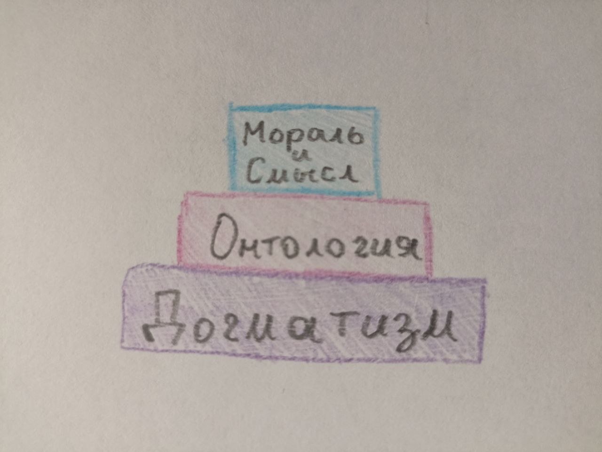
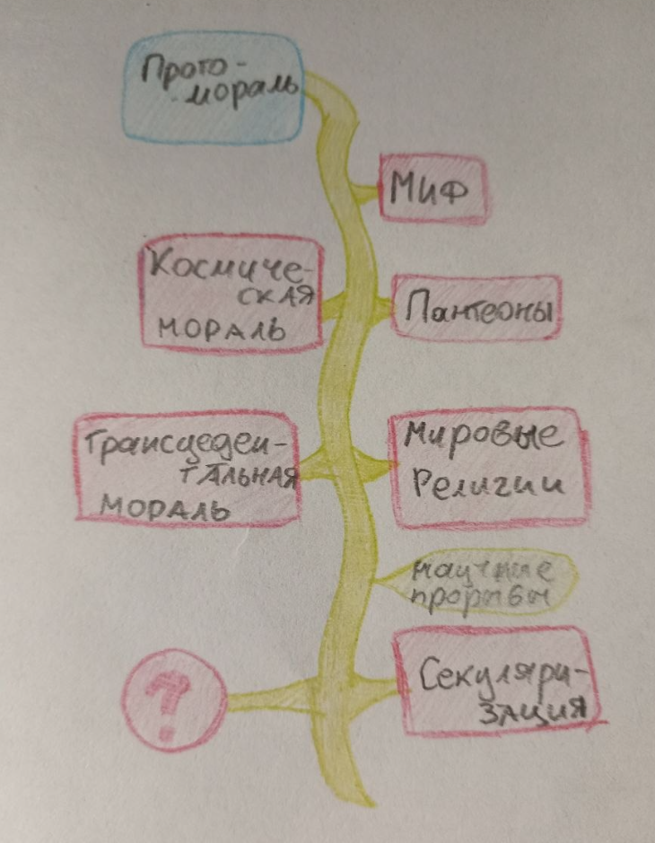
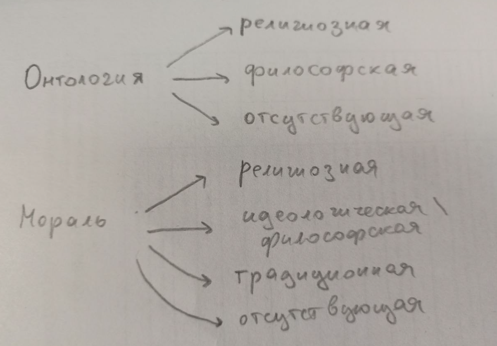

## Введение

В этом посте у меня две цели. Во-первых, разобраться с тем что из себя вообще представляет феномен религии — понять что это такое и как устроено и какие отличительные особенности отсюда следуют. Т.е. сместить моё понимание религии с отдельных школ веры на идею религии как таковую и чётко её обозначить, сравнить с альтернативами. Во-вторых, оценить проанализированную конструкцию сначала интуитивно, а затем в контексте моих нигилистических взглядов, чтобы выработать отношение к излагаемому концепту религии. Эта идея — оценивать религию через нигилизм — мне кажется забавной. 

{ width="400" align="left" }

Сразу скажу, что доп. литературы на эту тему я не читал и выводы сделаны лишь путём пары дней размышлений на эту тему, попыток найти общее, логически объяснить и оценить. Для оценки я использую нигилистическую систему взглядов на мораль (да и ценности в общем), изложенную в [этом посте](Мысли о сущности и положении морали.md), но к этому я вернусь лишь в конце.

## Основные признаки религии
{ width="400" align="right" }

Для начала я запустил опрос среди знакомых 10 человек интереса ради с просьбой "оцените концепт религии по десятибальной шкале". Результат на картинке и, конечно, выборка совершенно нерепрезентатина. Но по крайней мере ясно, что даже в современном обществе присутствуют люди со всем набором отношений к самой идее религии и вопрос выбора своей оценки до сих пор вовсе не тривиален.

Начну с самого очевидного: перечислю основные интитивные плюсы и минусы большинства религий, некоторые из которых в том числе подметили опрошенные. 

**Плюсы**

1. Сплочает общество изнутри, объединяет сильной идеей.
2. Даёт полную онтологию мира, т.е. отвечает на любознательные вопросы человека о происхождении мира.
3. Решает экзистенциальный кризис, даёт человеку смысл жизни и цель, часто заключающиеся в спасении души или избавлении от перерождений.
4. Выступает как coping mechanism во время особо трудных времён.
5. Содержит чёткую мораль, отделяющую хорошее и допустимое от греховного и защищает общество от деморализации.

**Минусы**

1. Онтология религии необоснована с точки зрения науки, неверифицируема и даже нефальсифицируема. Это означает, что наука признаёт её попросу ложной, а значит и вся религия считается обманом.
2. Использует догматизм вместо скептицизма и подавляет дальнейшую любознательность человека.
3. Между народами различных религий возникает напряжение и потенциал для конфликтов. Да и в целом религия способствует насилию (согласно мнению некоторых людей).
4. Влияет на мышление человека, делая его соображения чересчур устарелыми и традиционными, вновь не соотвествующими научной парадигме и даже логическому мышлению.
5. Замедляет технологический прогресс общества, сопротивляясь ему и смещая фокус ценностей на духовное, а не технологическое развитие.

Вероятно можно придумать что-то ещё, но мне этого списка существенных признаков религии хватило. Повторюсь, что я лишь перечислил "хорошие" и "плохие" признаки, но пока не даю самой религии или значимости
этих отдельных признаков оценки. К этому я вернусь в самом конце. Пока здесь я хочу рассмотреть в большей подробности лишь один пункт про связь религии и насилия, который не раз встречался мне в аргументации опросника, по той причине, что я считаю его фактически неверным. Я не тратил на происки время, но три нейросетки в один голос мне говорят, что статистические исследования насчёт связи религии и уровня насилия по всему миру не даёт однозначных результатов. В некоторых странах, например на севере Европы, уровень секуляризации высок и вместе с ним крайне малый процент преступности. Во всяких арабских и южно-американских странах можно заметить обратную тенденцию. Но логично предположить, что это корреляция между уровнем благосостояния общества, которое и определяет уровень насилия, и уровнем религиозности общества, а не между религиозностью и насилием непосредственно. Так религия больше нужна и исповедуется в тех странах, где итак всё весьма плохо. Если же смотреть на международные взаимоотношения и войны, поднимаемые во благо защиты веры, то тут религия выступает скорее политическим инструментов и предлогом государства для развязывания войны за влияние. Так было с крестовыми походами. Вероятно можно сказать, что то же верно для современных террористических организаций. Т.е. религия сама по себе не создаёт насилия, но используется для его оправдания и усиления. Справедливо будет упомянуть, что также плохо, что религия вообще способна выступать как подобный инструмент. Но кажется этим же свойством обладает любая система ценностей и акцентировать роль религии в этом вопросе я считаю лишним. 

Хочется также добавить уже чисто исторический факт того, что, в частности, христианство вообще породило современную индивидуалистскую мораль. Так в античности мораль была "для своих" и не порицала насилие над чужаками, варварами, рабами, даже иногда женщинами. Религия в этом случае наоборот проповедовала распространения морали и любви на каждого индивида вне зависимости от его положения и просхождения, способствовала развитию отношений. Эта часть учения вовсе не напоминает насилие. Конечно из-за смешения института религии с политикой образовался заметный разрыв между теорией и практикой, а также в самих священных писаниях можно найти намёки и призывы к насилию. Но как я это понимаю, насилие само по себе вовсе не является корневой частью религии и любые проблемы писаний решаются через их интерпретации, чем и занимается богословие. Так что хоть вопрос и может оказаться более сложным, способствование насилию как минус религии я буду считать мифом. Ещё один пункт насчёт сдерживания научного прогресса религией я затрону сильно далее.

Итак, основные признаки религии заключаются в создании общих интересов, которые одновременно сплочают общество и отдаляют от себя другие иноверные; крайне массивной психологической помощи индивиду; предоставлении объяснения мира, которое не является научно обоснованным и в целом заключает много неаргументированного и даже лжи; консерватизации общества и замедлению его технологического прогресса.

## Структура религии
Конечно для серьёзного рассмотрения вопроса, как всегда, нужно определиться с тем о чём мы говорим, т.е. что такое религия. Если в предыдущей части я говорил о влиянии, то здесь стоит указать содержимое. Ясно, что вера всегда говорит о чём-то ненаучном, нефальсифицируемом. Но является ли вера в плоскую землю религией? А в существование единорогов? А в могущественных существ на небесах, которые управляют развитием истории? Всё это само по себе религиями не является, даже последнее, т.к. религия это более сложный и обширный набор правил. Кроме веры во что-то из этого как минимум необходимо сделать широкий набор выводов и на этом строить своё поведение. Иначе подобная вера не будет иметь религиозного характера.

{ width="400" align="right" }

Исходя из предыдущих признаков я построил свою интерпретацию того из чего состоит структура религии в виде пирамидки. Три главных слоя идей любой религии: догматизм - онтология - мораль и смысл (сотериология, учение о спасении). Конечно тут я многое упрощаю. Во-первых, религия это вовсе не только теоретические воззрения, но и социальный институт, который требует ритуалов (от жертвоприношений до молитв и хождения в церковь), религиозных общин, священных писаний и сакральных текстов. В общем, специальной организации верующего общества, которая будет способствовать связи с сакральным и распространению этой религии. Но эта вторая часть — как бы традиция и практическая сторона реализации веры. Мне она не интересна и в целом кажется второстепенной по сути концепта, хоть и важной при непоследственном следовании религии. Тут я обсуждаю лишь содержание учения, т.е. философскую стороны веры :) Естественно, лол, у меня же всё про философию. 

Объясню смысл пирамидки, начав сверху и оценивая религию как умную и хитропродуманную систему воззрений. Я считаю, что для современного человека её верхушка это определённо самая значимая и полезная ступень. Религия даёт человеку набор правил о том как поступать по отношению к другим, т.е. мораль; даёт человеку объяснение для чего нужно продолжать жить, т.е. решает экзистенциальный кризис; и даже намечает эту тропу в виде особого пути к спасению, составляющего главную цель и награду жизни. Это именно то, что нужно и полезно людям до сих пор. Но просто взять и перечислить что является моральным \ аморальным и что нужно делать в жизни недостаточно при создании мировоззрения — никто не будет этому следовать, т.к. введённые правила нужно чем-то подкрепить. Религия справляется с этим через мифологические сюжеты, т.е. среднюю ступень пирамиды. Там я подписал её как "онтология", но на самом деле это именно трансцендентная онтология. Значит это то, что создаётся объяснение природы мира через сюжеты про нечто, что уже находится за его гранью. В этом основная разница с идеологиями и тут заключается основной гениальный механизм религии. Поскольку введённая мораль объясняется через существо вне нашего мира и его желания, то проверить и опровергнуть эту онтологию, в отличие от научных теорий, совершенно невозможно. Выходит подобная логика: тебе нужно воздерживаться от прелюбодеяния, т.к. это грех и его избегание ведёт к спасению, которое предназначает хорошим людям всемогущий Бог в раю, измерении за гранью доступного тебе при жизни мира. И проверить его существование и верность заповедей до непосредственной кончины невозможно. Ну а после неё... на жизни уже не скажется :) Единственное, что может помешать надёжности такой мифологический трансцедентной онтологии это банальное её неприятие из-за сомнения в верности всех этих красивых слов и здорового скептицизма. Хорошо ведь, что никто не может религию опровергнуть, но ведь никто не может её и доказать. Но и с этим эта гениальная конструкция справляется, т.к. создаёт третий фундаментальный слой религии — догматизм, т.е. слепую веру. В целом, догматизм объясняется самой онтологией веры и является её частью. Но поскольку он держит на себе всю онтологию и по сути обосновывает её, то я выделил его в отдельный слой. Онтология содержит догматизм, а догматизм "доказывает" онтологию. Продолжая мой пример, усомниться в верности сказанного Богом, как и в его существовании нельзя, т.к. само сомнение уже является грехом и спасены будут только те, кто будет верить всем сердцем в существование Бога и его законов. Те, кто им следовал, не веря в Бога, спасены не будут (по крайней мере в ортодоксальных течениях. Тут уже для разных интерпретаций могут быть различные богосословские решения, но в целом создаётся впечатление, что сама вера даже важнее следования добродетельному образу жизни). А потому даже пытаться усомниться в своей вере верующий по определению не может, все религиозные вопросы проходят на уровне интерпретаций писаний и устранения противоречий в их следствиях, но никогда фундаментальные принципы веры не сдвигаются со своего почётного места. Потому вера это воронка, которая засасывает и не даёт выбраться назад. Современная секуляризация частично повлияла на это и ослабила ортодоксальные каноны, введя массовую веру на "пол шишечки", как я это называю. По сути большинство людей в наше время, которые называют себя верующими, относятся к этой категории. Т.е. они не ходят в церковь, почти не молятся, не соблюдают священные практики и не ведут умеренную жизнь, но пассивно верят, что если они будут достаточно хорошими, то их ждёт спасение от какого-то там высшего существа, истории о котором они также если и знают, то максимально размыто. По сути таких людей и верующими мне назвать сложно, т.к. в моём понимании они не "уважают" нижние две ступени пирамиды, т.е. догматизм и онтологию, и относятся к вере недостаточно серьёзно, оставляя за собой право на сомнения. Отстутствие же крепкого фундамента в свою очередь делает нестабильным всё здание, предоставляя в свою очередь возможность переубедить верующего человека. А значит в таком виде религия своих целей, т.е. стабильного пожинания плодов верхней ступени, достигает хуже. 

Итого мы получаем крайне устойчивую и консервативную систему взглядов, которая освобождает человека от груза иррациональности мира и даёт ему множество ответов и рабочую модель поведения. Повторюсь, религия может изменяться и адаптироваться (этим на всём протяжении занималась как минимум религиозная философия — схоластика), но делает это очень неохотно и конкретно для её самосохранения это плюс. Так в 17-18 веках стал популярен деизм, т.е. религиозная философия, в которой у религии забрана часть мифа, объясняющая структуру физического мира и догматизм по отношению к священным писаниям. А Творцу отводится роль его создателя, который после акта сотворения перестал вмешиваться в развитие своего дитяти.  Это дало возможность науке полностью занять эту нишу. И процесс отдирания этой части от религии, насколько я знаю, в истории всё же был достаточно болезненный для учёных 16 века и растянулся на 2 столетия! И даже после этого религия в исходном виде осталась преобладающим мировоззрением, а деизм сохранил некоторые её части, отделяющие его от полного атеизма. Вот насколько успешна её структура! Когда я это понял, то мне лично всё это сразу показалось потрясающим, ведь отсюда понятно почему многие религии приняли знакомый нам вид и как сама идея религии исторически стала настолько успешной. Даже если в объяснении этого я игнорирую практическую сторону религии. Это непосредственно не значит, что религия это что-то нужно и прекрасное для общества, это вопрос другой. Но стоит признать, что сам концепт потрясающий и точно имеет своё эффективное применение.

## Зарождение и развитие религий

Тут я собираюсь исправить неточность, связанную с предыдущей частью. Ведь я с самого начала заявил, что рассматривать пирамиду буду сверху-вниз согласно функциональности религии в современном мире. Но подобный порядок объяснения не соответствует историческому процессу развития религий, который я и представлю здесь. Опять же, делаю это в своём упрощённом понимании, мб меня кто-то подправит тут.

{ width="300" align="left" }
Дело в том, что сама религия мораль не придумала, а надстроила свою над существующей. Ведь с самого начала у человека, как и у любого биологического вида, уже была естественная протомораль. Это биологический термин и существуют исследования насчёт того, как у самых разных достаточно развитых социальных видов заметно, что некоторые действия ими поощряются, а другие порицаются. Это же систему унаследовал и человек. Так что говорить, что религия развилась так потому, что выполняла морализаторскую миссию или приносила смысл — бред. Начиналось мистическое мировоззрение с мифа, цель у которого находится на другой ступени, онтологической. Ведь сперва людям потребовалось не столько решать экзистенциальный кризис, сколько лишить себя груза полной неопределённости и хаотичности окружающего мира. И естественным путём человечество начало наделять окружающую природу антропоморфными признаками, ясное дело проецируя. В общем первым делом развилась та онтологическая часть религии, которая была отброшена с переходом в деизм эпохи Просвещения. Далее миф видимо стал миллионами лет усложняться и перешёл уже в стадию пантеонов, которые, например, заметны у греков за тысячу лет до нашей эры. Тут по-прежнему во многом сохраняются черты естественной морали и во многом греки старались уподобляться природному порядку вещей, космосу. Поэтому я и назвал связанную с этим религиозным мировоззрением мораль космической. А это всё же мораль уже частично построенная на религии, примером тому служит, допустим, закон "ксения" греческого гостепреимства к странникам. Аргументировался он тем, что главный бог Зевс считался покровителем странников, и потому пренебрежение к ним могло сказываться в его каре. Также были распространены сюжеты, когда сами Боги являются в дома, скрывшись под видом обычного смертного. А проявить неуважение к богу, спустившемуся с Олимпа, это ту-ту-ту... В общем, явно появились новые особые моральные правила, обосновывающиеся текущей мифической онтологией. Но особенность текущей ступени в том, что боги пантеонов не были трансцендентны или всесильны. Они находились в том же самом мире и над ними властвовал рок. А значит пока не все фишки современных религий имели место быть и появилось немало философов атеистов и скептиков. Лукиан Самосатский, писатель 2 века н.э., вообще открыто высмеивал греческие пантеоны, выявляя их абсурдность, и не боясь при этом какой-то кары свыше. Следующая стадия мировых религий уже монотеистична и переводит Бога вне грани физического мира, завершая пирамиду. Да и в целом на этом этапе люди явно были малоотличны от нас и достаточно разумны, чтобы задаваться вопросами о природе блага, отношению к смерти и смысле жизни, несмотря на невероятно сильную родовую традицию. Всё это я мимолётом описывал в [этом рассказе](../Моя художка/Рассказ Мëртвый Мир.md). Так что наконец верхняя часть пирамиды была надёжна установлена и была функциональна значима. Следующие полторы тысячелетия подтвердили невероятную крепость такой конструкции религиозного мировоззрения. Но понятно, что на этом развитие нашего общества всё же не остановилось. Постепенный бунт против религии, основывающийся на полезности сдерживаемой науки, привёл к материализму и секулярности современного общества. Хотя, стоит заметить, что наука и религия вполне могут уживаться друг с другом, взять хотя бы известную статистику о религиозности ведущих учёных мира и тот факт, что многие учёные эпохи Просвещения всё также были религиозны, либо хотя бы деистами. В эту пору области объяснительной способности религии и науки больше не пересекались, а потому хочется повторно спросить как современная менее ортодоксальная религия задерживает научный прогресс? Наверное влияние есть, как, например, привыкание к традициям и догматизму, но вовсе не настолько ощутимое. Я лишь констатирую характер взаимодействия этих двух областей, не говоря о том хорош ли технологический прогресс вообще, даже если бы религия ему и существенно мешала. А так, кажется, что современное движение материализма составлено на иррациональном бунте на волне хейта религии и ничуть не более обоснован, чем тот же идеализм. Впрочем, эту идею я подчерпнул у одного современного идеалистического философа:))) Но суть в чём: теперь в обществе взрощен уже почти как новая традиция атеизм.  Как от этого меняется прежняя чисто религиозная мораль общества? Какие современные альтернативы религии, морали и спасению пришли? Ведь религия существовала столько тысячелетий не просто так, она была полезна развитию общества. Верно ли, что теперь она нам больше мешает, чем способствует?

## Альтернативы решениям религии

{ width="400" align="right" }

Не знаю когда зародились идеологии, но в 20 веке после "смерти" религии в некоторых странах они стали крайне заметной альтернативой. Так в чём же их различие с религией? На самом деле на уровне учения вещи эти крайне схожие. Основная разница на уровне онтологии. Так если религия черпает её из трансцендентного, то идеологии из физического. Например вместо следования святым правилам Господа ты должен бороться за всеобщее развитие общества, свободу пролетариата или превосходство твоей расы. Замечу, что сами по себе эти ценности и сюжеты ничем не лучше мифологических религиозных, т.к. по моему мнению всё также надуманы. Разве что выглядят чуть реалистичнее, да и то лишь для современного человека, который уже взрощен в материалистичном обществе. Вот и всё, отсюда теперь нужно брать следствия. Т.к. онтология переместилась на уровен физический, то она уже не настолько защищена от нападок науки и догматизм её не так обоснован. В идеологии уже вполне можно усомниться и спорить о ней, т.к. боишься ты не всевидящего Бога, а кары со стороны партии. Либо вовсе ничего не боишься и выступаешь против, т.к. веришь, что даже в худшем случае тебя ждёт просто смерть, а не вечные пытки в аду. Можно вспомнить аргумент Пари Паскаля, где он превозносит религиозную веру, исходя из того, что для любого человека это наиболее рациональное решение в состовнии неопределённости. В общем система идеологии менее стабильна. Аналогично и цель идеологии находится на физическом уровне и проверяема временем. Так я уже упоминал, что сложно проверить попал ли человек в рай или нет, мягко говоря. Однако проверить достигло ли государство обещанных народу условий за установленный срок крайне просто. И если этого не случилось, то вся идеология рушится. И этим, мне кажется, объясняется их стремительная смена в сравнении с извечным массивом неумирающей религии. Так что любое мировоззрение, претендующее на создание ценностей и морали исходя из физического уровня, в моих глазах гораздо хрупче структуры религии. И поэтому и сам концепт я оцениваю как менее прикольный. 

Теперь пройдусь конкретно по диаграммке выше. Различные альтернативы онтологии. У идеологии онтологии как таковой вроде особо нет, так что я выделил лишь философскую онтологию и отсутствующую. Философская онтология на самом деле мало чем отличается от религиозной, может аппелировать к максимально абстрактным идеям и суждениям, вероятно более интуитивно правдивым, чем религиозные сюжеты, но, как и идеология, менее надёжным и не защищённым слоем мифа о догматизме. Более того, в философии догматизм вообще нежелателен и развито критическое мышление. И это заметно в том как метафизики постоянно спорят и меняют под стать времени свои теории. Что ни хорошо, ни плохо в целом. Адаптация выходит выше. Но в моих глазах чему-то, что постоянно меняется поверить может быть сложнее. Так что функционально религиозная онтология, а следовательно и мораль, будут более убедительны и полезны человеку (если не учитывать полезность в той же науке всё того же критического мышления). Последней опцией, что я вижу, является попросту отказ от попыток дать ответ на что-то, что находится вне предмета изучения науки. Из чего состоит мир? Как он возник? Что такое истина и как её искать? Можно решить так: да какая разница, мы никогда точно не узнаем! И просто забить. Способ на уровне онтологии рабочий. Но помнится Рассел (в чём я его поддерживаю) выдвигал подобную критику говоря, что несмотря на то, что подобные метафизические теории и практически бесполезны они от этого полностью бесполезными и неважными не становятся. Так взять хотя бы неисчерпаемую человеческую любознательность — её уже достаточно как причины для того, чтобы подобные вопросы стали важными. И прагматики 20 века с этой точки зрения могут быть неправыми, т.к. пошли по этому третьему пути, полностью наплевав на эти вопросы и сдавшись в их решении.

У морали в сравнении есть на одну опцию больше. Так идеологию и философию я объединил в одну категорию, ведь как моральный нигилист считаю, что любая попытка чётко прописать правильную мораль это произвольная выдумка, основанная на тех или иных инстинктах. И каким образом мы их взяли меня тут не волнует. А значит и особой разницы в сравнении с религиозной моралью тут нет, разве что снова идеологическая и философская мораль оказываются менее устойчивыми перед нападками. Под традиционной моралью я имел ввиду бытовую интуицию человека о том что есть хорошо, а что плохо без дополнительных рассуждений. Причём за время существования человеческой цивилизации эта категория изменилась и больше не состоит из одной только протоморали. В современном обществе те же атеисты продолжают пользоваться пережитками христианской морали, возносящими ценность каждого индивида, о чём никогда не слышала биология. Это мне кажется слегка абсудным, т.к. фундамент для этой морали в виде онтологии у таких людей пропал и мораль просто повисает в воздухе, держась на одной только привычке. Впрочем, эта опция жизнеспособна как раз только в том случае или скорее до того момента, покуда человек не подпадает под проклятье, которым является рефлексия и переоценка существующих ценностей :) Тогда его карточный домик сразу рушиться, если только он не найдёт под него подходящий идеологический или реже философский миф. Последней опцией всё также является отрицание. С моей точки зрения эта самая честная опция — признать, что никакой верной и однозначной "высокой морали" не существует, но есть только правила общества, подстроенные из-за той или иной нужды, явно или неявно. Однако какие следствия ждут человека, избравшего этот путь? Ведь похожим образом становится понятно, что нет ни естественного смысла жизни, ни путей к спасению, ни цели. Всё это в совокупности будто бы должно значительно влиять на психику человека, которому все эти ответы нужны для здорового функционирования. Либо, как я упоминал, нужно хотя бы забытье и игнорирование этих вопросов до поры до времени. Но их полное отвергание образует в человеке дыру и у меня нет очевидных примеров чем её заполнить, кроме как начать относиться к жизни, как к несущественной игре до той степени, до которой позволяют инстинкты.

Остальные вещи, приносимые религией, вроде смысла жизни и спасения я рассматривать не буду, т.к. у них получится похожий обзор. Закончу я эту часть на небольшом вкраплении статистических данных. Современное общество (имея ввиду развитые страны Европы и Америку) постепенно отказывается от религии в пользу указанных альтернатив. Явных идеологий в наше время уже нет (или я о них не знаю), философия доступна далеко не всем и остаётся либо игнорировать один из самых существенных вопросов человеческой жизни, либо отказываться от существования ответов, что, как я написал, может вести к нездоровью. И это, по крайней мере косвенно, подтверждает статистика. Т.к. процент несчастья населения развитых стран, процент депрессий и суидов всё увеличивается. Может быть это лишь корреляция, но я не знаю этому лучшего объяснения, чем следствие из отказа от даваемых на протяжении стольких веков религией ответов на экзистенциальный, моральный и онтологический вопросы. А значит отказ от религии имел чёткие негативные последствия для общества. Допускаю, что как и в случае с насилием, счастливые люди могут быть более склонны к религиозности. Но это мне не кажется логичным. Копать в это мне лень, потому как текущей целью не является. 

## Нигилистическая оценка религии

Наконец-то! Написав столько о религии можно начать оценивать её. Итак, я заключаю, что оценка невозможна. Вот она, ловушка нигилизма. Это лишь очередной повод применить последовательную нигилистичную позицию о невозможности свести субъективные оценки к каким-то объективным результатам. Снова могу сослаться на свой пост о проблемах морали, где я прихожу к моральному нигилизму и привожу его следствия. Но распространяется мысль, конечно, не только на мораль. Я могу сказать, что мне больше нравится философская онтология, чем религиозная. Ведь не зря я сам выбрал нигилизм, а не христианскую мораль. Однако это ещё не значит, что я могу хоть как-то оценивать является ли она лучше для всех, или даже для кого-то в частности, или лучше сама по себе, что бы это не значило. Вопрос оценки базируется полностью на чувствах: нравится \ не нравится, подходит под остальные мои воззрения и желания или не подходит. Но ни что не является лучше или хуже. Тогда и сказать лучше религия или идеология также невозможно. А ведь именно эти вещи дают понятие о том что такое правильно \ неправильное, доброе \ злое. А значит объективной оценки всех этих понятий также не существует. Общество может прелюбодействовать, убивать, врать, а может творить чудеса искусства и совершать технологические прорывы. Но какая мне в конец разница, если это не затронет лично меня чувственно, что является делом произвольности? В этом и заключается принцип аморальности и он, как я вижу, решает кучу парадоксальных философских проблем и наиболее честен. Похоже на всё тот же побег прагматиков от метафизики, с одной стороны, но нет. Т.к. там они объявляли вопрос несущественным, а здесь нигилизм даёт чёткий ответ на вопрос о смысле мира — его отсутствие. Думаю хватит мусолить эту очевидную позицию. Под конец я дам лишь ещё 2 замечания.

Первое это то, что хоть и называемой мною "высокой моралью" морали не существует, но можно строить свои фиктивные моральные законы, если мы всё же договорились всем обществом о том чего нам всем инстинктивно хочется. Не буду упоминать о том насколько маловероятным это пока что кажется. Но, например, частым ответом может оказаться "всеобщее улучшение качества жизни и его поддержание", тогда ценностью становится всё то же знакомое благо общества, только уже избавленное от идеологической мишуры. И можно будет честно сразу казнить любого, который выступит против нашей морали. Не потому что он делает что-то неправильно, О-нет. Просто потому что он не находится в позиции сильного и не может отстоять свои желания. Ведь это всё тот же естественно-аморальный мир. По сути, мы формулируем свой произвольный математический критерий о том, что мы хотим максимизировать. И это полностью логично, т.к. как иначе что-то оценивать? А это уже задача оптимизации. Вероятно решение её будет невероятно сложным, если будет практически возможным. А значит стоит брать не точное, а любое приблизительное решение, которые уже позволит медленно, но верно двигаться к поставленной цели. Это уже гораздо лучше, чем находится в неопределённости и постоянно спорить о том какое из решений наиболее оптимизированно. Подобная ситуация наблюдается в коммутации пакетов в сетях, где они направляются по любому достаточно хорошему маршруту, lul.

Чтобы не оставлять вопрос оценки совсем уж на открытой ноте, я предоставлю всё же своё субъективное мнение. Мб это позиция крайне гедонистична, но мне кажется крутым, когда человек живёт в довольстве и не испытывает лишений, если он сам их не желал. То же относится и к экзистенциальным вопросам, которые как-то всё же нужно для благополучия закрыть. И религия в этой роли, согласно описанному выше, наиболее эффективно справляется. Можно продолжить говорить о минусах, заключающихся в явной ложности выдвигаемой онтологии и ценности прогресса. Но они перестают быть минусами, если сама правда не является ценностью, как и прогресс. Ведь сам по себе прогресс это вещь для улучшения качества жизни людей и удовлетворения нашего любопытства. Второе не настолько факторно в таком важном вопросе, а первое напоминает о той аналогии с маршрутизацией пакетов. Возможно стоило бы прекратить развивать общество по инерции, когда оно достигнет весьма хорошего уровня жизни? Как житель зажиточного города могу сказать, что этот уровень вокруг меня уже достигнут. Ясно, что это верно не для всех мест на нашей голубой планете, но вероятно, что в будущем и отсталые места смогут выйти на уровень моего проживания. И тогда стоит будет задуматься о том, что стабильность может быть важнее бесконечной погони за прогрессом, если и не делать этого уже сейчас. В общем, я прогресс сам по себе не уважаю, хоть он мне и интересен в целом, как и правда сама по себе. Причём для меня самого выбор наиболее "правдивой" философии, т.е нигилизма, наоборот 100% предпочтителен. Но это субъективно и я не считаю, что остальным правда должна быть важна. Человеку полезно врать себе и сдерживать количество саморефлексии, чтобы жить полноценнее и комепнсировать за дефект нашей эволюции.

В общем, если я познакомлюсь когда-то с истинно религиозным сверстником, то не стану его, как это распространено у атеистов, переубеждать против его желания. Т.к. с моей текущей субъективной позиции его сладкая ложь это великое счастье и было бы преступлением лишать его этого дара. Ведь обратно поверить в какой-то религиозный миф это задача, пожалуй, непосильная. Ну а для меня лично эта дорога уже закрыта. Но и эту мою позицию я на других распространять насильно не собираюсь, если только мне рандомно этого не захочется, т.к. она ничем не лучше остальных. 